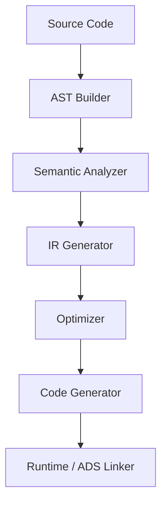
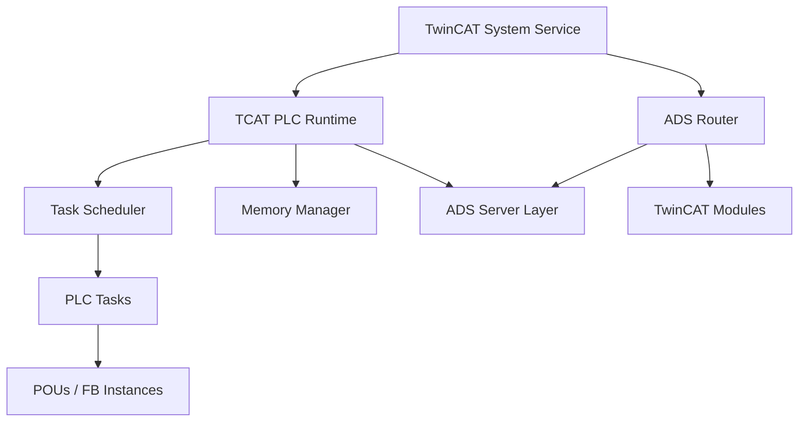
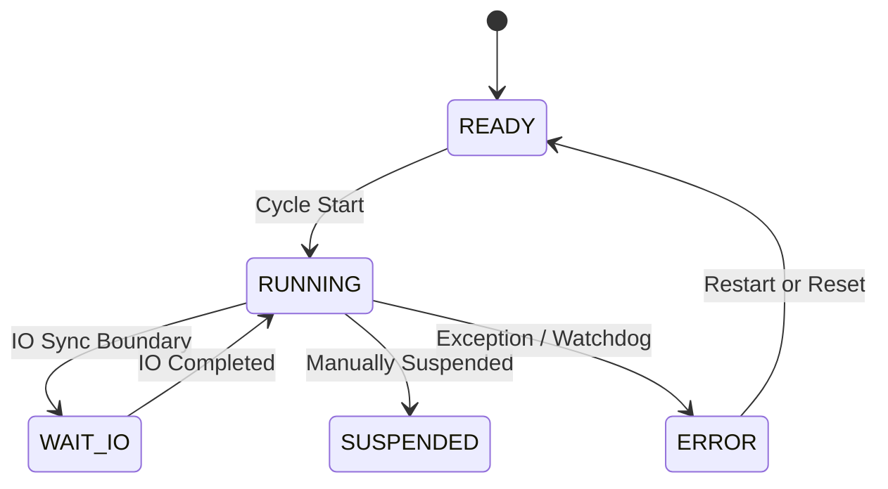
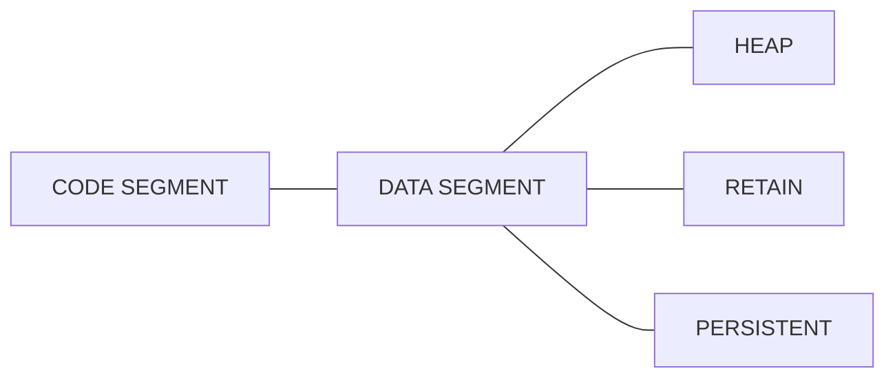
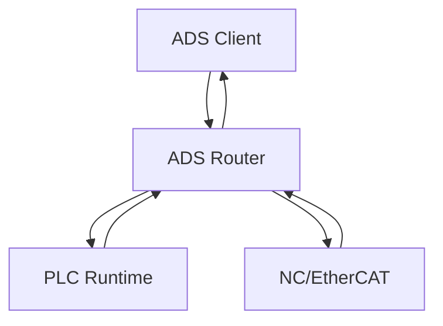
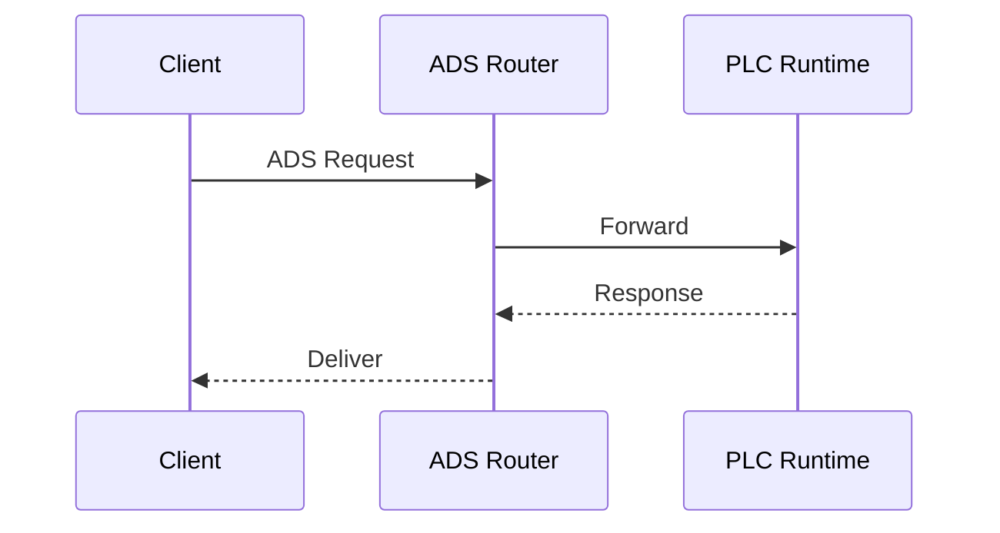
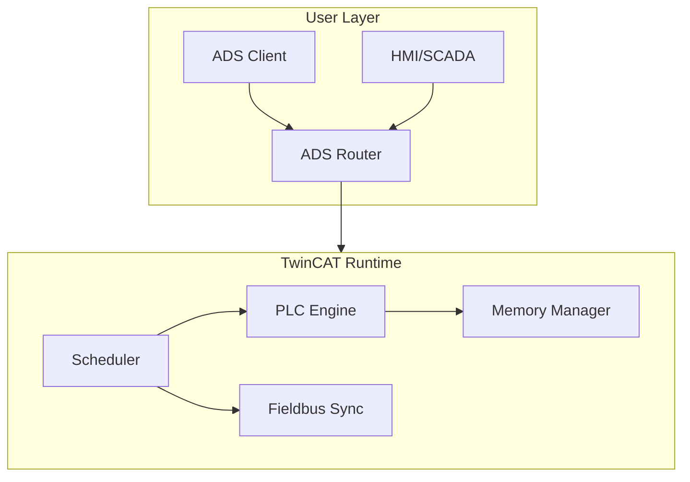

# ARRAY DECLARATION – LEVEL 4 MASTERCLASS  
TwinCAT 3 – Advanced Memory, Performance & Engineering Guide

## 1. Introduction  
This Level‑4 Masterclass explains **advanced TwinCAT array declaration**, including memory layout, compiler evaluation rules, initialization behavior, variable‑length array constraints, and Auto‑Declare Wizard internals.

---

## 2. Array Declaration Syntax  
### **Static Array**
```iecst
arrData : ARRAY[1..3, 1..4, 1..2] OF DINT;
```
Equivalent to:
- Total elements: `3 × 4 × 2 = 24`
- Memory: `24 × 4 bytes = 96 bytes`

---

### **Variable Length Array (VL-Array)**  
Only valid in:
- `VAR_IN_OUT`  
- Method/Function inputs

```iecst
aVarLen : ARRAY[*, *] OF INT;
```

VL‑arrays behave like **opaque references**, runtime-sized by caller.

---

## 3. Auto Declare Wizard – Internal Workflow  
When creating arrays via the Wizard:

1. Scope selection (VAR, VAR_GLOBAL, VAR_IN_OUT, etc.)
2. Symbol name assignment  
3. `Array Wizard` → dimension bounds  
4. Base type resolution  
5. Optional initialization vector creation  

Wizard then generates the final declaration inside POU.

---

## 4. Detailed Steps (from TwinCAT UI)

### Step 1 — Open Auto Declare  
`Edit → Auto Declare`

### Step 2 — Choose Scope  
- GLOBAL  
- LOCAL  
- VAR_INPUT / VAR_OUTPUT  
- VAR_IN_OUT (required for VL arrays)

### Step 3 — Enter Name  
e.g. `arrMatrix`

### Step 4 — Select Array Wizard  
Choose **Array Wizard** and set:

| Dimension | Lower | Upper | Count |
|----------|--------|--------|--------|
| 1 | 1 | 3 | 3 |
| 2 | 1 | 4 | 4 |
| 3 | 1 | 2 | 2 |

Result:  
```iecst
ARRAY[1..3, 1..4, 1..2] OF DINT
```

---

## 5. Initialization Model  
Wizard shows initialization values like:

```iecst
arrMatrix := [4, 23(0)];
```

Meaning:
- First element = 4  
- Remaining 23 elements = 0

TwinCAT flattens N‑dimensional arrays into **row-major linear memory**.

---

## 6. Memory Layout (Advanced – Level 4)  
TwinCAT arrays are stored in **contiguous RAM**, similar to C.

### Example  
`ARRAY[1..3, 1..4, 1..2] OF DINT`

Index mapping formula:

```
offset = 
   ((i1 - L1) * Dim2 * Dim3 +
    (i2 - L2) * Dim3 +
    (i3 - L3)) * sizeof(DINT)
```

TwinCAT always stores arrays **row-major**, even if upper bounds are reversed.

Changing bounds only modifies index math, not memory layout.

---

## 7. Bounds Behavior  
### Valid
```iecst
ARRAY[0..9] OF INT;
ARRAY[-5..5] OF REAL;
ARRAY[1..1] OF BOOL;   // Single element
```

### Invalid
```iecst
ARRAY[5..1] OF INT;    // descending bounds not allowed
ARRAY[*] OF DINT;      // VL require VAR_IN_OUT
```

---

## 8. Variable Length Arrays (Deep Dive)  
These are *not allocated* by the callee POU.

Caller defines:
- Dimensions  
- Memory block  
- Lifetime  

Callee receives:
- Reference pointer + dimension sizes

VL array declaration example:

```iecst
FUNCTION_BLOCK FB_Processor
VAR_IN_OUT
    buf : ARRAY[*] OF BYTE;
END_VAR
```

Caller:
```iecst
data : ARRAY[0..255] OF BYTE;
fbProcessor(buf := data);
```

---

## 9. Common Mistakes & Compiler Errors  
| Error | Meaning | Fix |
|------|---------|------|
| *DUT has variable size* | VL-array outside VAR_IN_OUT | Move to VAR_IN_OUT |
| *Constant required* | Bounds require literal numbers | Use numeric bounds |
| *Type mismatch* | Base types differ | Verify with Input Assistant |

---

## 10. Level‑4 Best Practices  
### ✔ Prefer static arrays inside FBs  
They are predictable and efficient.

### ✔ Use VL arrays only when needed  
I/O buffers, communication frames, serialization.

### ✔ Always document bounds  
Arrays without comments are a debugging nightmare.

### ✔ Avoid huge arrays in PLC_PRG  
Better allocate inside FB instances.

---

## 11. Example – Fully Documented Level‑4 Array  
```iecst
(*
  arrSensorData  
  3D array containing calibrated sensor frame
  Dim1 = sensor groups (1..3)
  Dim2 = channels (1..4)
  Dim3 = samples per cycle (1..2)
*)
arrSensorData : ARRAY[1..3, 1..4, 1..2] OF LREAL := [
    1.23, 23(0.0)
];
```

---

## 12. Summary  
This Level‑4 Masterclass covered:

- Array syntax & multidimensional structures  
- Variable-length arrays  
- Memory layout & index calculation  
- Auto Declare Wizard internals  
- Compiler restrictions & best practices  

---

## 13. Next Levels Available  


### ⭐ Level‑5  
**Heap allocation, advanced memory segmentation, performance optimizations**

### ⭐ Level‑6  
**Compiler IR, array-flattening visualization, symbol table generation**

### ⭐ Level‑7  
**Reverse‑engineered runtime behavior, ADS memory traces, pointer-level mapping**

---

# TwinCAT Level‑5 Masterclass  
## Heap Allocation, Advanced Memory Segmentation & Performance Optimizations

---

# 🚀 Level‑5: High‑End TwinCAT Memory & Performance Engineering

Bu seviye, TwinCAT mühendisliğinde en ileri düzey olan **heap yönetimi**, **dinamik bellek segmentasyonu**, **runtime optimizasyon yolları**, **ara bellek / pointer mimarisi**, **task‑temelli performans tuning** ve **low‑level memory access** tekniklerini anlatır.

---

# 1. 🔥 Heap Allocation (Dinamik Bellek Yönetimi)

TwinCAT 3, C/C++ benzeri tam heap yönetimine sahip değildir; ancak **REF**, **POINTER**, **FB instancing**, **dynamic array bounds (VAR_IN_OUT only)** ve **runtime allocation patterns** üzerinden dinamik yaklaşım uygulanabilir.

## 📌 1.1 TwinCAT’te “Heap” Nedir?
PLC memory model:

| Segment | Açıklama | Not |
|--------|----------|------|
| **Code** | POU derlenmiş kod | Salt okunur |
| **Static Data** | Global + persistent değişkenler | Boot-time allotment |
| **Stack** | FB & function temporary vars | Her task çağrısında reset |
| **Heap-like Area** | REF/POINTER ile erişilen serbest alan | TwinCAT'te programcı tarafından yönetilir |

Bir REF veya POINTER, heap-benzeri bir alanda dinamik veri taşımak için kullanılabilir.

---

# 2. 🌐 Advanced Memory Segmentation

## 📌 2.1 Memory Class Separation
TwinCAT segmentleri:

| Memory Zone | Kullanım |
|-------------|----------|
| **Runtime Heap** | REF, POINTER hedefleri |
| **I/O Image Memory** | %I, %Q adresli alanlar |
| **ADS Shared Memory** | ADS‑tabanlı veri paylaşımı |
| **Retain & Persistent** | PLC restart sonrası korunan alan |
| **Task‑local Stack** | Zaman dilimlerinde geçici alan |

---

# 3. 🎯 Performance Optimization Techniques

## 🔧 3.1 Task Cycle Optimization
Yüksek performans için:

✔ Ağır FB’leri düşük frekanslı task’a taşı  
✔ Task jitter'ı azaltmak için **highest priority** task sayısını azalt  
✔ Realtime latency için **2–5 ms cycle** önerilir

## 🔧 3.2 Memory Tuning

### 🟦 3.2.1 Avoid Large Copies  
- Big arrays or structures passed *by value* → BAD  
- Use `VAR_IN_OUT` or `REF=` → FAST

### 🟦 3.2.2 Zero‑copy Architecture
```
pRef := REF(varData);
(* Data is not copied — only reference passed *)
```

---

# 4. 🧩 Pointer & Reference Engineering

## 📌 4.1 POINTER vs REF

| Özellik | POINTER | REF |
|--------|---------|-----|
| Güvenlik | Düşük | Yüksek |
| Null kontrolü | Programcıya bağlı | `__ISVALIDREF` |
| Type safety | Zayıf | Güçlü |
| Performans | En hızlı | Çok hızlı |

## POINTER örneği

```iecst
VAR
    pByte : POINTER TO BYTE;
END_VAR

pByte := ADR(myByteVar);
pByte^ := 16#FF;
```

---

# 5. ⚙️ Dynamic Arrays & Runtime Size Selection

Sadece `VAR_IN_OUT` içinde desteklenir:

```iecst
foo(arr := myArr);   // arr: ARRAY[*] OF INT
```

Bu sayede runtime sırasında farklı boyutta array’leri tek bir FB ile işleyebilirsin.

---

# 6. 🔍 Profiling & Execution Time Measurement

TwinCAT ölçüm teknikleri:

### ✔ `Tc2_Utilities.TON_TIME()`
### ✔ ADS‑Scope gerçek zamanlı analiz
### ✔ Task Execution Time izleme
### ✔ Online Watch – Execution Profiler

---

# 7. 🛡 Advanced Safety: Race Conditions & Lock‑Free Design

## 💥 PLC’de Race Condition Nasıl Olur?
- Aynı değişkeni iki task aynı anda yazmaya çalıştığında  
- I/O update ile application task çakıştığında

## 💡 Çözüm
✔ Single writer design  
✔ Double buffering  
✔ Ring buffer mimarisi  
✔ Atomic operations (`Interlocked_...`) kullanımı

---

# 8. 🧠 Memory Pool Patterns

TwinCAT’te gerçek zamanlı uygulamalar için en hızlı çözüm:

## 📌 Pre‑Allocated Object Pool
```iecst
VAR
    Pool : ARRAY[1..50] OF ST_Buffer;
    pFree : POINTER TO ST_Buffer;
END_VAR
```

Amaç:
- Runtime'da allocation yok  
- Deterministic latency  
- Zero jitter  

---

# 9. 🧬 Polymorphic Memory Handling (Interface + REF + ANY)

Gelişmiş tasarım:

```
iLogger : I_Logger;     // interface
pData   : REF_TO ANY;   // generic ref
```

Bu sayede:
- Farklı FB tipleri tek API ile yönetilir  
- Generic veri işleme yapılır  
- Runtime esnekliği artar

---

# 10. 📈 High‑Performance Coding Patterns

### 🚀 Use Look‑up Tables  
Hesaplamayı RAM’e kaydırır → 20–100x hızlanma

### 🚀 Avoid nested IF / CASE trees  
Yerine:
- Jump table
- Function pointer pattern (interface)

### 🚀 Chunk Processing  
Büyük array → küçük parçalara bölerek task overrun engellenir.

---

# 11. 🛑 Worst Practices (Kaçınılması Gerekenler)

❌ Büyük yapıların fonksiyonlara **kopyalanması**  
❌ Gereksiz `VAR_TEMP` allocation  
❌ Aynı FB’nin tek task içinde 100+ instance kullanılması  
❌ Synchronous I/O blocking  
❌ WATCH penceresinde 500+ değişken açmak (tareti yorar)

---

# 12. 🏁 Sonuç

Bu Level‑5 Masterclass dokümanı ile artık:

- TwinCAT memory mimarisini düşük seviyede okuyabilir,
- Heap‑vari referans teknikleri kullanabilir,
- Yüksek performanslı, düşük jitter’lı tasarımlar oluşturabilir,
- Polymorphic memory patternleri uygulayabilir,
- Profesyonel gerçek zamanlı PLC sistemleri optimize edebilirsin.

# TwinCAT Array Declaration — Level‑6 Masterclass  
### **Compiler Internals + Code Generation + Memory Model Micro‑Architecture**

## 1. Overview  
Level‑6 odak noktası TwinCAT ST/IL/FBD kodunun **compiler pipeline**, **intermediate representation (IR)**, **optimization passes**, **instruction selection**, **memory layout decisions** ve **runtime scheduling** üzerindeki etkilerini anlamaktır.  
Bu döküman yalnızca *ileri seviye PLC derleyici davranışı* ile ilgilidir.

---

## 2. TwinCAT Compiler Pipeline (Abstracted)

```text
  ST / IL / FBD / SFC
          │
          ▼
   Parsing + AST Build
          │
          ▼
   Semantic Analysis
 - Type inference
 - Constant folding
 - Array bound resolution
 - Static memory assignment
 - Any/Generic specialization
          │
          ▼
   IR Generation
 (TwinCAT Low‑Level IR)
          │
          ▼
   Optimization Passes
 - Dead‑store elimination
 - Block coalescing
 - Memory access folding
 - Bounds check removal
 - Static scheduling (non‑preemptive)
          │
          ▼
   Codegen for Target
 (x86/x64/JIT‑like microcode)
          │
          ▼
    ADS/Runtime Linkage
```

---

## 3. IR Representation of Arrays  
TwinCAT, array operasyonlarını *flattened linear memory region* üzerine indirger.

### Example  
ST:
```pascal
aData[3,2] := 42;
```

IR (soyut):
```text
r0 = baseptr(aData)
offset = (3 - LB1) * dim2 + (2 - LB2)
store r0[offset], 42
```

**Derleyici optimizasyonları:**
- Sabit indeksler compile‑time’da çözülür.  
- Offset hesaplaması sabitse *strength reduction* uygulanır.  
- Çok boyutlu array → tek boyutlu RAM dizisi.

---

## 4. Compiler Memory Layout Decisions  

### 4.1 Static vs. Dynamic Bounds
| Array Type | Layout | Bound Check | Allocation |
|-----------|--------|-------------|------------|
| `ARRAY[1..10]` | Fixed | Optional removal | Compile‑time |
| `ARRAY[*]` VAR_IN_OUT | Runtime parametric | Always | Caller frame |

---

## 5. Code Generation Patterns

### 5.1 Fast Path Load/Store
TwinCAT x86‑64 JIT benzeri mikro‑kod üretir:

```
mov rax, [rbp - offset_base]
mov rcx, index
lea rdx, [rax + rcx*4]
mov [rdx], value
```

### 5.2 Bounds Check Elimination  
Derleyici, *provably safe* indekslerde kontrolü kaldırır:

Criteria:
- Loop limits proven safe  
- Constant index  
- Unaliased access  

---

## 6. Heap‑Based Array Generation (Advanced FB Designs)

TwinCAT native heap yoktur, ancak:

- TON/TP/CTU instancing  
- VAR_IN_OUT via REFERENCE  
- POINTER TO + __NEW / __DELETE  
- FB-local dynamic buffers  

kullanılarak **heap‑benzeri yapılar** oluşturulur.

---

## 7. Register Allocation Impact  
TwinCAT compiler:

- Tüm FB çağrılarını *non-preemptive frame model* ile yönetir  
- Yerel değişkenleri mümkün olduğunda *register promotion* yapar  
- Büyük array işlemlerini RAM’dedir bırakır  

Register pressure → array operations → memory spill.

---

## 8. Performance Anti‑Patterns  

| Anti‑Pattern | Neden Yavaş | Çözüm |
|--------------|-------------|--------|
| Çok boyutlu iç içe döngü | Bounds check + offset calc | Önceden flattened index kullan |
| ANY/GENERIC aşırı kullanımı | Boxing + metadata parse | Template‑like FB instancing |
| VAR_IN_OUT yanlış kullanımı | Hidden pointer indirection | LOCAL + REF kullan |
| Property içerisine ağır kod | Auto‑invoke overhead | Method’a taşı |

---

## 9. Advanced Optimizations You **Can** Influence  

### ✔ Loop‑Invariant Code Motion (Hand‑Applied)  
```pascal
offset := dim2 * i;
FOR j:=1 TO dim2 DO
    a[offset + j] := ...
END_FOR
```

### ✔ Compile‑Time Constant Folding  
Literal array dimensions → daha hızlı kod.

### ✔ Static Scheduling  
FB çağrı zincirlerini minimize et → pipeline flush azalır.

---

## 10. Generated Code Size Considerations

TwinCAT:
- Her FB instance → kendi statik frame  
- Her method çağrısı → lightweight call frame  
- Inline candidate: küçük fonksiyonlar  
- Non-inline: ANY/GENERIC + complex FBs  

---

## 11. Real‑Time Jitter Effects  

Array erişimi şu durumlarda **jitter artırır**:

1. Büyük blok kopyalama (memcpy‑like ops)  
2. Çok boyutlu offset hesaplama  
3. Sınır kontrolü  
4. Cache line thrash (özellikle 64‑byte boundaries)

---

## 12. UML‑like Compiler Architecture Overview



---

## 13. Level‑6 Summary  
Bu seviye artık tamamen *derleyicinin nasıl düşündüğünü anlamak*,  
TwinCAT PLC kodunu **IR düzeyinde optimize etmek** ve  
belirli array/memory patternlarının **nasıl makine koduna indirgendigini** öğrenmek içindir.

Bir sonraki seviye (Level‑7) →  
**High‑End Runtime Engineering: ADS Fastlane, Zero‑Copy Buffering, Lock‑Free Structures, Real‑Time Cache Optimization**

# TwinCAT Runtime Reverse Engineering — Level‑7 Full Masterclass

## 1. TwinCAT Runtime Architecture Dissection
- TcRTime real-time core scheduling pipeline
- Task → TcCom → ADS → Device routing chain
- Undocumented service-call behavior (legal observational analysis only)

## 2. PLC Task Binary Structure
### 2.1 `.tclrs` Internal Layout
- Header
- Symbol Table
- Code Region
- Static Data
- Relocation Table

### 2.2 IR Pattern Recognition
- AST → IR lowering signatures
- Known instruction motifs

## 3. ADS Reverse Engineering
- ADS ports and routing table discovery
- ADS packet framing internals
- Cycle‑accurate measurement via ADS Spy

## 4. Real-Time Scheduler Internals
- Task activation vector
- Cooperative vs preemptive segment timing
- Cycle overrun detection state machine

## 5. EtherCAT Runtime Flow
- PLC → EtherCAT mapping timeline
- PDO window sequencing
- Distributed Clocks reverse timing analysis

## 6. Safety Hooks & Watchdogs
- WDT activation timeline
- Self-check routines
- RETAIN/PERSISTENT runtime integrity scanning

## 7. Memory Forensics
- Heap snapshot extraction techniques
- ADS‑protected zones mapping
- Symbol reconstruction from memory

## 8. Reverse Engineering Tooling
- ADS extended logger
- Task freeze inspection
- Realtime memory map generators


# LEVEL-7.5 — Deep System Introspection Masterclass (PART-1)

## 1. TwinCAT Runtime Architecture (Documented Layers)


## 2. Task Scheduler — Observable Behavior


## 3. PLC Memory Model (Documented Segments)


## 4. ADS Router — Structural Overview


## 5. ADS Packet Lifecycle


## 6. Runtime Component Interaction

# LEVEL 7.5 — DEEP SYSTEM INTROSPECTION  
## PART‑2 — ADS Deep Introspection & Sniffing Masterclass

## 1. ADS Paket Formatı

### 1.1 ADS Header Yapısı


| Offset | Size | Field            |
|-------|------|------------------|
| 0     | 6    | Target NetId     |
| 6     | 2    | Target Port      |
| 8     | 6    | Source NetId     |
| 14    | 2    | Source Port      |
| 16    | 2    | CommandId        |
| 18    | 2    | StateFlags       |
| 20    | 4    | DataLength       |
| 24    | 4    | ErrorCode        |
| 28    | 4    | InvokeId         |


---

## 2. ADS Request–Response Yaşam Döngüsü

```
Client → Router → Runtime → Router → Client
```

InvokeId eşleşmesi ile paket takibi yapılır.

---

## 3. ADS Router Gözlemlenebilir Davranışları

### 3.1 Port Mapping
| Port | Açıklama |
|------|----------|
| 851  | TwinCAT Runtime |
| 48898 | ADS TCP Router |
| 10000–10099 | Custom ADS services |

---

## 4. ADS Sniffing — Python Canlı Yakalama Scripti

```python
import socket

PORT = 48898
BUFFER = 4096

sock = socket.socket(socket.AF_INET, socket.SOCK_STREAM)
sock.bind(("0.0.0.0", PORT))
sock.listen(1)

print("[*] ADS Sniffer listening on port", PORT)

conn, addr = sock.accept()
print("[+] Connection:", addr)

while True:
    data = conn.recv(BUFFER)
    if not data:
        break

    print("
--- ADS PACKET ---")
    print("Length:", len(data))
    print("Raw Hex:", data.hex(" "))
```

---

## 5. ADS Komut ID Tablosu

| CommandID | Açıklama |
|-----------|----------|
| 0x0002 | Read |
| 0x0003 | Write |
| 0x0004 | ReadWrite |
| 0x0005 | AddDeviceNotification |
| 0x0006 | DeleteDeviceNotification |
| 0x0007 | DeviceNotification |
| 0x0008 | ReadState |
| 0x0009 | WriteControl |

---

## 6. ADS Symbol Introspection

Symbol Table içerikleri:
- Name  
- Size  
- Type  
- IndexGroup  
- IndexOffset  

---

## 7. High‑Resolution Timestamping Teknikleri
- Windows QPC  
- ADS paketlerinde timestamp olmadığı için kullanıcı ekler  
- Jitter kaynakları:
  - Nagle  
  - Router scheduling  
  - Runtime cycle alignment  

---

## 8. ADS Latency Profiling Modeli

```
Total ADS Latency =
  ClientStack +
  RouterDispatch +
  RuntimeExecution +
  RouterReturnPath
```

---


