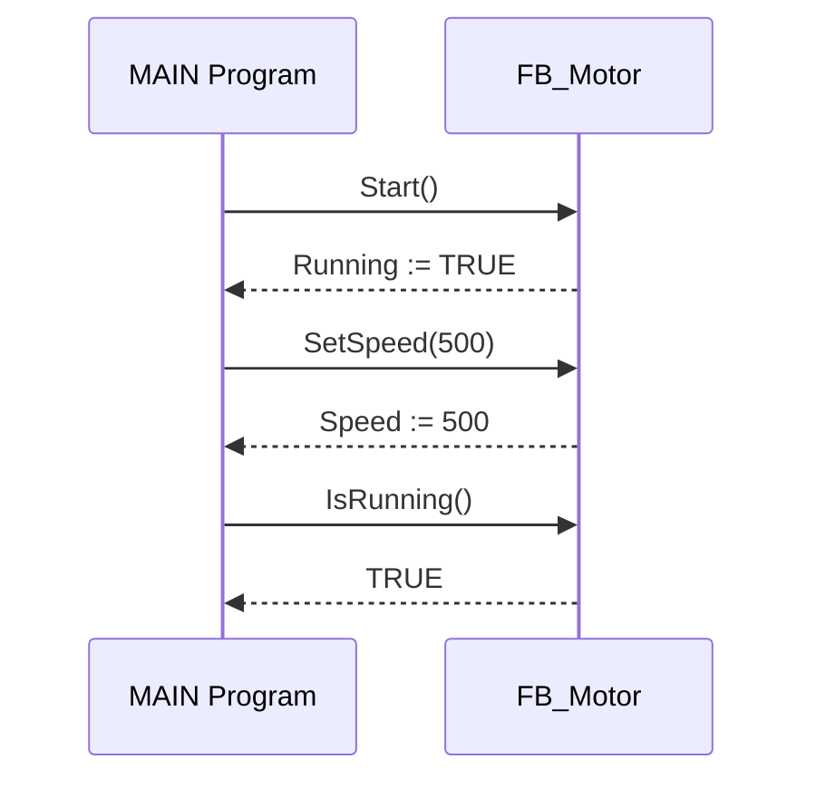
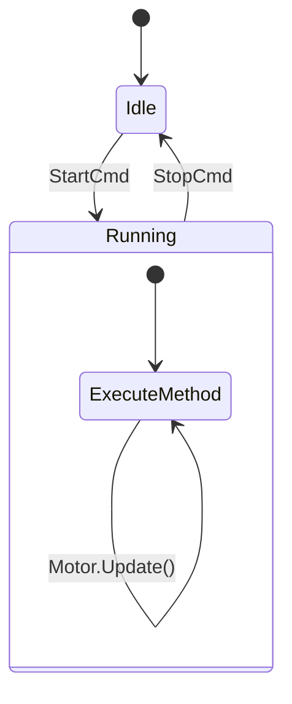
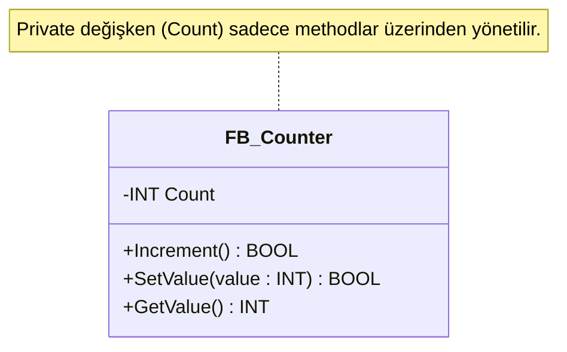

# TwinCAT PLC – METHOD Derinlemesine Eğitim  
## (C# Karşılaştırmalı, Şemalı ve Egzersizli)

---

# 1. METHOD Nedir?

TwinCAT PLC’de **Method**, bir **Function Block (FB)** içindeki davranış birimidir.  
C#’taki class metodlarının doğrudan karşılığıdır.

✔ FB’nin iç mantığını modülerleştirir  
✔ Kodu düzenli ve okunabilir kılar  
✔ Parametre alabilir, değer döndürebilir  
✔ Private FB değişkenlerine erişebilir  

---

# 2. METHOD Yapısı (PLC vs C#)

## TwinCAT PLC
```pascal
METHOD MethodName : ReturnType
VAR_INPUT
    Param1 : INT;
END_VAR
(* body *)
```

## C#
```csharp
ReturnType MethodName(int Param1)
{
    // body
}
```

---

# 3. METHOD Mantık Şeması
```
+----------------------------------+
|        FB_Example                |
|----------------------------------|
| Internal Variables               |
|----------------------------------|
| MethodA(input)  → işlem yapar    |
| MethodB()       → sonuç döndürür |
+----------------------------------+
```

---

# 4. METHOD Türleri

### Parametresiz Method
```pascal
METHOD Reset
Count := 0;
```

### Parametreli Method
```pascal
METHOD AddValue : BOOL
VAR_INPUT NewVal : INT; END_VAR
Count := Count + NewVal;
AddValue := TRUE;
```

### Değer Döndüren Method
```pascal
METHOD GetStatus : BOOL
GetStatus := (Count > 10);
```

### VOID Method
```pascal
METHOD Update
IF Count > 100 THEN Count := 100; END_IF
```

---

# 5. METHOD’ün FB İçindeki Rolü

FB = Nesne  
Method = Nesnenin davranışı

Her FB instance’ı kendi methodlarını bağımsız yürütür.

---

# 6. Method Çağrısı

## PLC
```pascal
MyCounter.Increment();
MyCounter.SetValue(50);
IF MyCounter.IsHigh() THEN ...
```

## C#
```csharp
myCounter.Increment();
myCounter.SetValue(50);
if(myCounter.IsHigh()) …
```

---

# 7. METHOD Kullanım Alanları

✔ Hesaplama fonksiyonları  
✔ Kontrol algoritmaları  
✔ Veri işleme  
✔ Donanım kontrol rutinleri  
✔ SFC step action'larında alt görevler  

---

# 8. METHOD İçindeki Değişken Türleri

- `VAR_INPUT` → parametre  
- `VAR_OUTPUT` → method çıkışı  
- `VAR_IN_OUT` → referans parametre  
- `VAR` → local değişken  
- FB’nin iç değişkenleri → method tarafından erişilebilir  

---

# 9. METHOD Derin Örnek: FB_Motor

```pascal
FUNCTION_BLOCK FB_Motor
VAR
    Running : BOOL;
    Speed   : INT;
END_VAR

METHOD Start
Running := TRUE;
Speed := 500;

METHOD Stop
Running := FALSE;
Speed := 0;

METHOD SetSpeed
VAR_INPUT NewSpeed : INT; END_VAR
IF (NewSpeed >= 0) AND (NewSpeed <= 3000) THEN
    Speed := NewSpeed;
END_IF

METHOD IsRunning : BOOL
IsRunning := Running;
```

### Yapı Şeması
```
+------------------------+
|       FB_Motor         |
|------------------------|
| Running, Speed         |
|------------------------|
| Start()                |
| Stop()                 |
| SetSpeed(new)          |
| IsRunning() → BOOL     |
+------------------------+
```

---

# 10. METHOD Egzersizleri

## Egzersiz 1
`FB_TimerUtils` oluştur ve method yaz:
- StartTimer(StartValue : TIME)
- ResetTimer()
- IsElapsed() : BOOL

## Egzersiz 2
`FB_Filter` oluştur.
- AddSample(Sample : INT)
- Son 5 değerin ortalamasını hesaplayan yapı oluştur.

## Egzersiz 3
`FB_Axis` oluştur.
- MoveTo(TargetPos : LREAL)
- Stop()
- IsInPosition() : BOOL

---

# 11. METHOD + SFC Kullanımı

SFC action içinde method çağırma:
```pascal
Act_Run:
Motor.Update();
Motor.SetSpeed(1000);
```

---

# 12. METHOD En İyi Pratikler

| Yapılmalı | Yapılmamalı |
|-----------|-------------|
| Metodları küçük ve tek amaçlı tut | Çok iş yapan büyük metod yazma |
| Parametre doğrulama yap | Geçersiz inputları kabul etme |
| Kapsüllemeyi koru | Tüm değişkenleri public yapma |
| Anlamlı dönüş değeri kullan | Gereksiz TRUE döndürme |

---

# 13. METHOD Debug İpuçları

✔ Breakpoint konabilir  
✔ Watch window’dan izlenebilir  
✔ FB instance değerleri canlı güncellenir  

---

# TwinCAT PLC – METHOD Mermaid Diyagramları Eğitim Paketi  
## (Tamamı Mermaid Tabanlı Görsel Açıklamalar)

---

# 1. METHOD’un Function Block İçindeki Yeri


---

# 2. METHOD Çağrı Akışı (Flowchart)

```mermaid
flowchart TD
    A[Program Başlangıcı] --> B[FB_Motor instance oluştur]
    B --> C[Start() çağır]
    C --> D[SetSpeed(1000) çağır]
    D --> E{Running = TRUE?}
    E -->|Evet| F[Motor çalışıyor]
    E -->|Hayır| G[Hata: Start başarısız]
```

---

# 3. METHOD Parametre Akışı (Sequence Diagram)



---

# 4. Method İçinde Değer Kontrolü (Decision Flow)

```mermaid
flowchart TD
    A[SetSpeed(NewSpeed)] --> B{NewSpeed 0-3000 arası mı?}
    B -->|Evet| C[Speed := NewSpeed]
    B -->|Hayır| D[Error := TRUE]
    C --> E[Method Sonu]
    D --> E[Method Sonu]
```

---

# 5. METHOD’un SFC İçindeki Kullanımı (State Diagram)



---

# 6. METHOD + Encapsulation (Kapsülleme)



---

# 7. METHOD Derin Akış Örneği – Motor Başlatma

```mermaid
flowchart TD
    A[Start()] --> B[Running := TRUE]
    B --> C[Speed := 500]
    C --> D{Speed < 500 mü?}
    D -->|Evet| E[Hata: Low Speed]
    D -->|Hayır| F[Başarılı Start]
```

---


