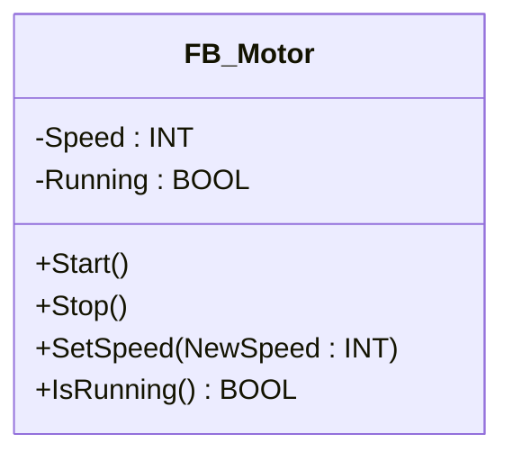
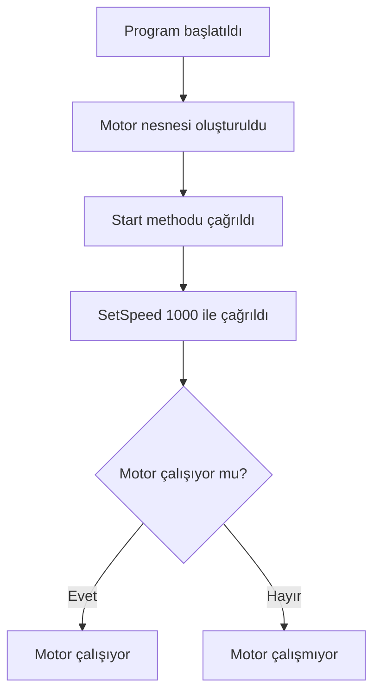
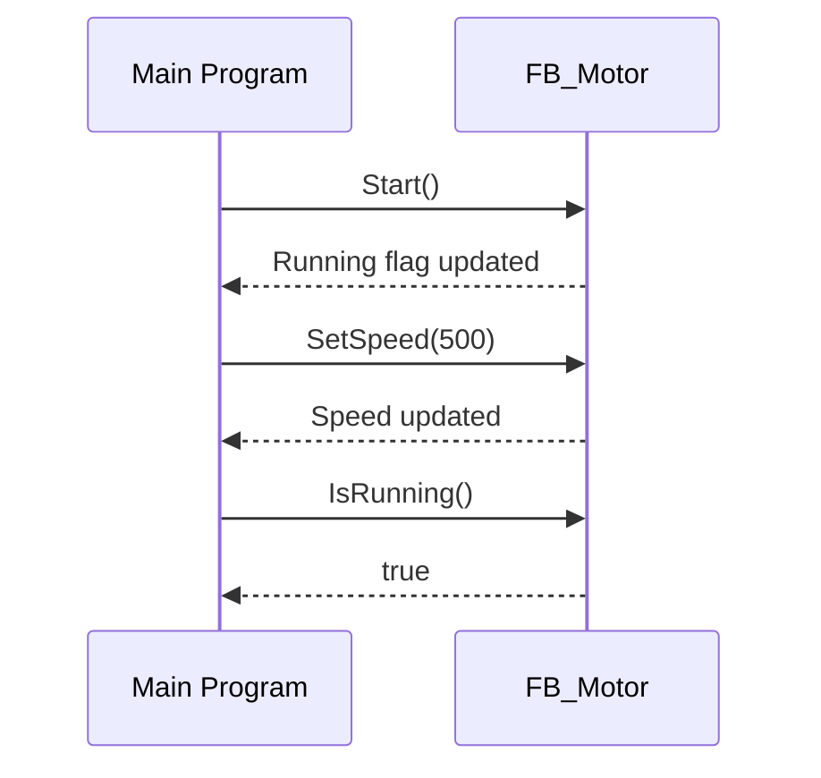
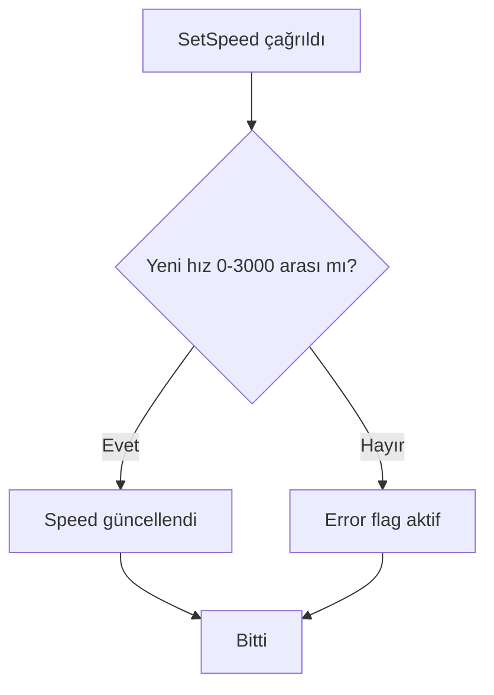
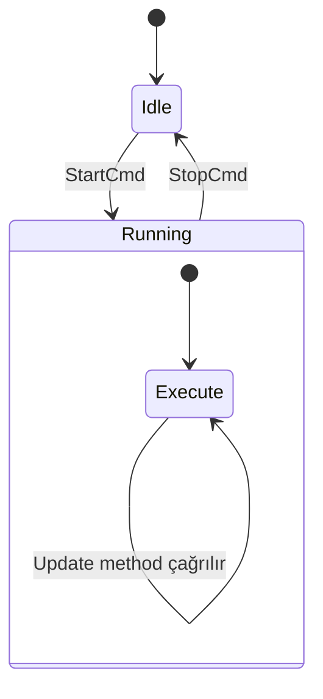
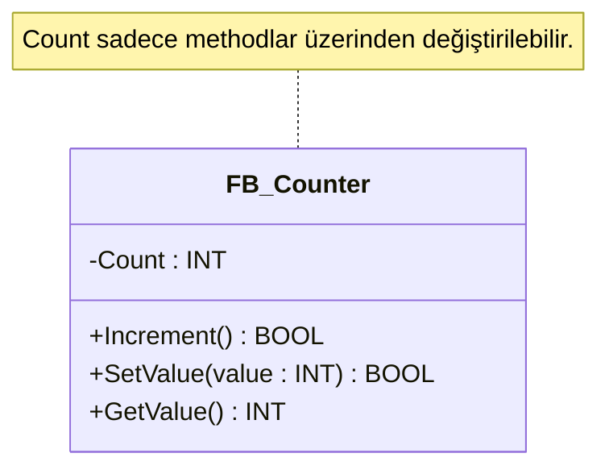
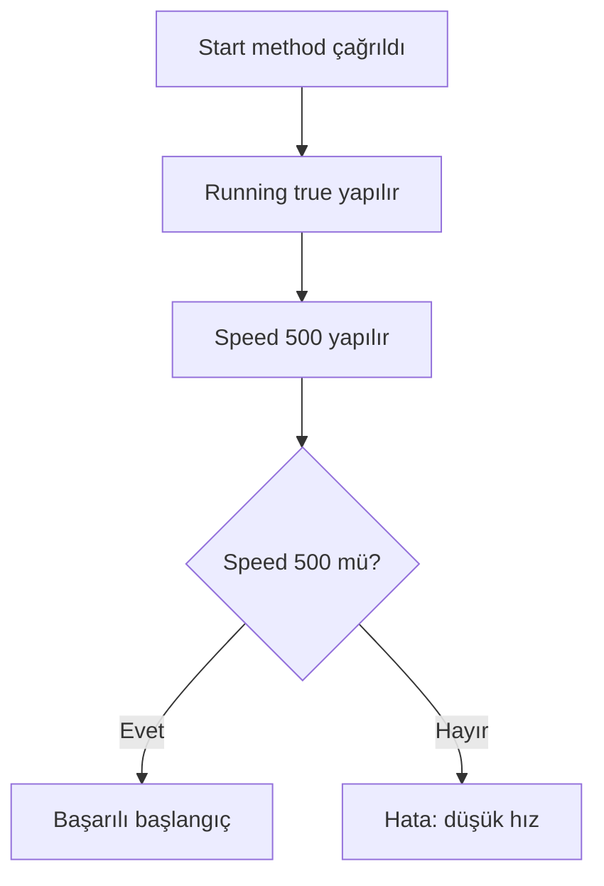

# TwinCAT PLC – METHOD Derinlemesine Eğitim  
## (C# Karşılaştırmalı, Şemalı ve Egzersizli)

---

# 1. METHOD Nedir?

TwinCAT PLC’de **Method**, bir **Function Block (FB)** içindeki davranış birimidir.  
C#’taki class metodlarının doğrudan karşılığıdır.

✔ FB’nin iç mantığını modülerleştirir  
✔ Kodu düzenli ve okunabilir kılar  
✔ Parametre alabilir, değer döndürebilir  
✔ Private FB değişkenlerine erişebilir  

---

# 2. METHOD Yapısı (PLC vs C#)

## TwinCAT PLC
```pascal
METHOD MethodName : ReturnType
VAR_INPUT
    Param1 : INT;
END_VAR
(* body *)
```

## C#
```csharp
ReturnType MethodName(int Param1)
{
    // body
}
```

---

# 3. METHOD Mantık Şeması
```
+----------------------------------+
|        FB_Example                |
|----------------------------------|
| Internal Variables               |
|----------------------------------|
| MethodA(input)  → işlem yapar    |
| MethodB()       → sonuç döndürür |
+----------------------------------+
```

---

# 4. METHOD Türleri

### Parametresiz Method
```pascal
METHOD Reset
Count := 0;
```

### Parametreli Method
```pascal
METHOD AddValue : BOOL
VAR_INPUT NewVal : INT; END_VAR
Count := Count + NewVal;
AddValue := TRUE;
```

### Değer Döndüren Method
```pascal
METHOD GetStatus : BOOL
GetStatus := (Count > 10);
```

### VOID Method
```pascal
METHOD Update
IF Count > 100 THEN Count := 100; END_IF
```

---

# 5. METHOD’ün FB İçindeki Rolü

FB = Nesne  
Method = Nesnenin davranışı

Her FB instance’ı kendi methodlarını bağımsız yürütür.

---

# 6. Method Çağrısı

## PLC
```pascal
MyCounter.Increment();
MyCounter.SetValue(50);
IF MyCounter.IsHigh() THEN ...
```

## C#
```csharp
myCounter.Increment();
myCounter.SetValue(50);
if(myCounter.IsHigh()) …
```

---

# 7. METHOD Kullanım Alanları

✔ Hesaplama fonksiyonları  
✔ Kontrol algoritmaları  
✔ Veri işleme  
✔ Donanım kontrol rutinleri  
✔ SFC step action'larında alt görevler  

---

# 8. METHOD İçindeki Değişken Türleri

- `VAR_INPUT` → parametre  
- `VAR_OUTPUT` → method çıkışı  
- `VAR_IN_OUT` → referans parametre  
- `VAR` → local değişken  
- FB’nin iç değişkenleri → method tarafından erişilebilir  

---

# 9. METHOD Derin Örnek: FB_Motor

```pascal
FUNCTION_BLOCK FB_Motor
VAR
    Running : BOOL;
    Speed   : INT;
END_VAR

METHOD Start
Running := TRUE;
Speed := 500;

METHOD Stop
Running := FALSE;
Speed := 0;

METHOD SetSpeed
VAR_INPUT NewSpeed : INT; END_VAR
IF (NewSpeed >= 0) AND (NewSpeed <= 3000) THEN
    Speed := NewSpeed;
END_IF

METHOD IsRunning : BOOL
IsRunning := Running;
```

### Yapı Şeması
```
+------------------------+
|       FB_Motor         |
|------------------------|
| Running, Speed         |
|------------------------|
| Start()                |
| Stop()                 |
| SetSpeed(new)          |
| IsRunning() → BOOL     |
+------------------------+
```

---

# 10. METHOD Egzersizleri

## Egzersiz 1
`FB_TimerUtils` oluştur ve method yaz:
- StartTimer(StartValue : TIME)
- ResetTimer()
- IsElapsed() : BOOL

## Egzersiz 2
`FB_Filter` oluştur.
- AddSample(Sample : INT)
- Son 5 değerin ortalamasını hesaplayan yapı oluştur.

## Egzersiz 3
`FB_Axis` oluştur.
- MoveTo(TargetPos : LREAL)
- Stop()
- IsInPosition() : BOOL

---

# 11. METHOD + SFC Kullanımı

SFC action içinde method çağırma:
```pascal
Act_Run:
Motor.Update();
Motor.SetSpeed(1000);
```

---

# 12. METHOD En İyi Pratikler

| Yapılmalı | Yapılmamalı |
|-----------|-------------|
| Metodları küçük ve tek amaçlı tut | Çok iş yapan büyük metod yazma |
| Parametre doğrulama yap | Geçersiz inputları kabul etme |
| Kapsüllemeyi koru | Tüm değişkenleri public yapma |
| Anlamlı dönüş değeri kullan | Gereksiz TRUE döndürme |

---

# 13. METHOD Debug İpuçları

✔ Breakpoint konabilir  
✔ Watch window’dan izlenebilir  
✔ FB instance değerleri canlı güncellenir  

---

# TwinCAT PLC – METHOD Mermaid Diyagramları (Github Uyumlu)
## Tüm Diyagramlar Düzeltilmiş Hatasız Versiyon

---

# 1. METHOD’un Function Block İçindeki Yeri



---

# 2. METHOD Çağrı Akışı (Flowchart)



---

# 3. METHOD Parametre Akışı (Sequence Diagram)



---

# 4. Method İçinde Değer Kontrolü (Decision Flow)



---

# 5. METHOD’un SFC İçindeki Kullanımı (State Diagram)



---

# 6. METHOD + Encapsulation (Kapsülleme)



---

# 7. METHOD Derin Akış Örneği – Motor Başlatma



# Otomatik Doldurma Makinesi – METHOD Kullanımı Senaryo Dokümanı  
## (Kod içermeyen, sadece mantık odaklı açıklama)

---

# 1. Senaryo: Otomatik Doldurma (Dozajlama) Makinesi

Bu sistemin temel görevleri:

1. Depodan sıvı çekmek  
2. Dolum vanasını açmak  
3. Şişeyi hedef seviyeye kadar doldurmak  
4. Aşırı dolumu engellemek  
5. Dolumu tamamlayıp vanayı kapatmak  
6. Bir sonraki şişeye geçmek  

Bu süreç bir **Function Block (FB)** içinde methodlar kullanılarak yönetilir.  
Her method, sistemin farklı bir davranışını temsil eder.

---

# 2. Kullanılacak Methodlar ve Seçim Mantığı

---

## 2.1 Initialize()  
**Amacı:** Sistemi bilinen ve güvenli bir başlangıç durumuna getirmek.

**Neden bir method?**  
- Sistem açıldığında tüm değişkenler tek noktadan düzenlenmelidir.  
- Başlangıç aşaması farklı modüllerin hazırlanmasını içerir.  

**Mantık:**  
- Seviye sensörü sıfırlanır  
- Vana kapalı mı kontrol edilir  
- Alarm bayrakları temizlenir  
- Sayaçlar ve durumlar resetlenir  

---

## 2.2 StartFilling()  
**Amacı:** Dolum sürecini başlatmak.

**Neden bir method?**  
Doluma geçmek bağımsız bir eylemdir. Bu eylemin:

- Güvenlik kontrolleri  
- Başlangıç ayarları  
- Loglama  
- Durum değişiklikleri  

gibi adımları vardır.

**Mantık:**  
- Vana açılır  
- “Dolum aktif” durumu set edilir  
- Tank seviyesi ve sistem uygunluğu doğrulanır  

---

## 2.3 StopFilling()  
**Amacı:** Dolum sürecini güvenli şekilde durdurmak.

**Neden bir method?**  
Dolumu durdurmak ile başlatmak tamamen farklı süreçlerdir. Ayrı method olması:

- Okunabilirliği artırır  
- Güvenliği merkezi hale getirir  
- Test etmeyi kolaylaştırır  

**Mantık:**  
- Vana kapatılır  
- Süre hesaplanır  
- Durum pasif yapılır  
- Log kaydı tutulabilir  

---

## 2.4 UpdateLevel()  
**Amacı:** Seviye sensöründen gelen ham veriyi anlamlı hale getirmek.

**Neden bir method?**  
Seviye okuma genellikle:

- Filtre gerektirir  
- Gürültü azaltma mantığı içerir  
- Sensör doğrulama gerektirir  

Bu yüzden ayrı bir davranış olarak tanımlanmalıdır.

**Mantık:**  
- Sensör değerini al  
- Filtre uygula (EMA, deadband vb.)  
- Sistem içinde güncel seviyeyi sakla  

---

## 2.5 IsFull()  
**Amacı:** Şişenin ya da tankın hedef seviyeye ulaşıp ulaşmadığını belirlemek.

**Neden bir method?**  
Bu karar başka birçok yerde kullanılabilir.  
Karar kuralları zamanla değişebilir ama method arayüzü değişmez.

**Mantık:**  
- Güncel seviye hedef ile karşılaştırılır  
- Tolerans uygulanabilir  
- Gerekirse aşırı dolum kontrolü yapılır  

---

## 2.6 SafetyCheck()  
**Amacı:** Güvenliğin merkezden kontrol edilmesini sağlamak.

**Neden bir method?**  
Güvenlik kuralları:

- Farklı yerlerde dağınık olursa
- Sistemin davranışı öngörülemez olur

Tüm güvenlik logiği tek noktada olmalıdır.

**Mantık:**  
- Seviye çok hızlı artıyorsa kaçak kontrolü yapılır  
- Tankta sıvı yoksa dolum durdurulur  
- Sensör hatalarında alarm üretilir  
- Maksimum süre aşılırsa hata verilir  

---

## 2.7 ResetAlarms()  
**Amacı:** Operatör müdahalesinden sonra sistemi tekrar hazır duruma getirmek.

**Neden bir method?**  
Alarm resetleme:

- Güvenlik gerektirir  
- Tek bir standarda oturtulmalıdır  

**Mantık:**  
- Alarm bayraklarını temizle  
- Sistem durumunu default hale getir  

---

# 3. Genel Süreç Akışı (Methodların Birlikte Kullanımı)

Aşağıdaki süreç methodların nasıl birlikte çalıştığını gösterir:

```
Initialize()
↓
StartFilling()
↓
Loop:
   UpdateLevel()
   SafetyCheck()
   if IsFull() → StopFilling()
↓
ResetAlarms()
```

Her method, sistemin ayrı bir davranışını kontrol eder:

- **Initialize()** → Başlangıç hazırlığı  
- **StartFilling()** → Süreç başlangıcı  
- **UpdateLevel()** → Sürekli izleme  
- **SafetyCheck()** → Sürekli koruma  
- **IsFull()** → Karar verme  
- **StopFilling()** → Süreç sonlandırma  
- **ResetAlarms()** → Hata sonrası toparlama  

---

# 4. Neden Bu Method Yapısı Doğru?

| Method | Mantık | Sağladığı Fayda |
|--------|--------|------------------|
| Initialize() | Açılış kontrolü | Temiz başlangıç |
| StartFilling() | Süreç tetikleme | Net davranış ayrımı |
| StopFilling() | Güvenli durdurma | Risk azaltma |
| UpdateLevel() | Sensör işleme | Modülerlik |
| IsFull() | Karar kontrolü | Tek sorumluluk |
| SafetyCheck() | Güvenlik yönetimi | Merkezi kontrol |
| ResetAlarms() | Hata toparlama | Standartlaşma |

Bu yapı hem **TwinCAT FB mimarisine**, hem de **C# sınıf tasarım prensiplerine** tam uyumludur.

---

# 5. Sonuç

Bu senaryo sayesinde:

- METHOD kavramı gerçek bir endüstriyel proses üzerinden anlaşılır  
- Hangi methodun *neden* seçildiği net şekilde görülür  
- Behavior-based tasarım ortaya çıkar  
- Kod yazmadan bile method tasarımı yapılabilir hale gelir  

---

# Konveyör Bant Üzerinde Kamera Tabanlı Kalite Kontrol Sistemi  
## METHOD Kullanımı İçin Kod İçermeyen Senaryo Dokümanı

---

# 1. Senaryo: Konveyör Üzerinde Kamera Tabanlı Kalite Kontrol

Bu sistemde ürünler konveyör üzerinden geçer ve kamera/sensör sistemi kalite kontrolü yapar.  
Sistem görevleri:

1. Ürünü algılamak  
2. Kamerayı tetiklemek  
3. Görüntüyü analiz etmek  
4. Ürünü PASS/FAIL olarak sınıflandırmak  
5. Hatalı ürünleri banttan ayırmak  
6. Sayım ve raporlama yapmak  

Bu doküman, sistemi **methodlarla mantıksal olarak tasarlamayı** açıklar.

---

# 2. Kullanılacak Methodlar ve Mantıksal Gerekçeleri

---

## 2.1 DetectProduct()  
**Amaç:** Ürünün konveyöre girişini tespit etmek.

### Neden method?
- Sadece ürün algılamaya odaklıdır.  
- Sensör gürültüsü, titreşim, arka plan etkileri burada filtrelenir.  

### Mantık:
- Sensör sinyali değerlendirilir  
- Ürün “gerçek” olarak algılanmışsa süreç başlar  
- Ürün giriş zamanı kaydedilir  

---

## 2.2 TriggerCamera()  
**Amaç:** Kamerayı doğru anda tetiklemek.

### Neden method?
- Kamera tetiklemesi milisaniye hassasiyeti gerektirir.  
- Ürün tam hizadayken tetiklenmelidir.  

### Mantık:
- Kamera tetik sinyali gönderilir  
- Exposure süreci başlatılır  
- Kamera hazır/boşta durumu değerlendirilir  

---

## 2.3 AnalyzeImage()  
**Amaç:** Alınan görüntüyü işleme algoritmasına iletmek.

### Neden method?
- Görüntü işleme süreci karmaşıktır ve diğer süreçlerden ayrılmalıdır.  
- Algoritma değişirse yalnızca bu method güncellenir.  

### Mantık:
- Görüntü işleme başlatılır  
- Süre ve performans izlenir  
- Algoritmanın ürettiği skor alınır  

---

## 2.4 Classify()  
**Amaç:** Analiz sonucu ürünün PASS/FAIL kararını vermek.

### Neden method?
- Kalite karar mantığı merkezi olmalıdır.  
- Eşik değerler (threshold) buradan yönetilir.  

### Mantık:
- Skor > eşik → PASS  
- Skor ≤ eşik → FAIL  

---

## 2.5 ActuateRejector()  
**Amaç:** Hatalı ürünleri bant dışına atmak.

### Neden method?
- Ayırma mekanizması (piston, flap vb.) fiziksel bir eylemdir.  
- Risk içerir ve zamanlama kritiktir.  
- Fail logic’i bu methodda izole edilmelidir.  

### Mantık:
- Fail ürünün konuma gelmesi için gecikme hesaplanır  
- Rejector mekanizması tetiklenir  
- Güvenlik kontrolleri yapılır  

---

## 2.6 UpdateCounters()  
**Amaç:** İstatistiksel sayım değerlerini güncellemek.

### Neden method?
- PASS/FAIL/Toplam sayılar birçok süreçte kullanılabilir.  
- Sayım mekanizması analizden bağımsız olmalıdır.  

### Mantık:
- Toplam ürün sayısı artırılır  
- PASS veya FAIL sayısı güncellenir  

---

## 2.7 LogResult()  
**Amaç:** Her ürünün sonuçlarını kayıt altına almak.

### Neden method?
- İzlenebilirlik (traceability) gereksinimdir.  
- Endüstriyel kalite sistemlerinde zorunludur.  

### Mantık:
- Zaman damgası  
- PASS/FAIL sonucu  
- Kamera ID  
- Ölçüm değerleri  

---

## 2.8 ResetSystem()  
**Amaç:** Hata sonrası sistemi temiz başlangıç durumuna getirmek.

### Neden method?
- Hatalarda tüm state’ler tutarlı şekilde sıfırlanmalıdır.  

### Mantık:
- Sayaçlar sıfırlanabilir  
- Alarm durumları temizlenir  
- Mekanik eyleyiciler güvenli konuma getirilir  

---

# 3. Methodların Birlikte Çalışma Akışı (Mantıksal Süreç)

```
DetectProduct()
↓
TriggerCamera()
↓
AnalyzeImage()
↓
Classify()
↓
   PASS → UpdateCounters()
   FAIL → ActuateRejector() → UpdateCounters()
↓
LogResult()
```

Hata olması durumunda:

```
ResetSystem()
```

---

# 4. Tasarımın Sağladığı Avantajlar

| Fayda | Açıklama |
|------|----------|
| Modülerlik | Her davranış ayrı methodla yönetilir |
| Test Edilebilirlik | Her method bağımsız test edilebilir |
| Okunabilirlik | Karmaşık süreçler sade ve anlaşılır olur |
| Esneklik | Algoritma veya donanım değiştiğinde sadece ilgili method güncellenir |
| Güvenlik | Rejector gibi riskli mekanizmalar merkezi kontrol edilir |
| İzlenebilirlik | Tüm kalite süreci sistematik olarak loglanır |

---

# 5. Sonuç

Bu senaryo, METHOD kullanımı için mükemmel bir gerçek dünya örneğidir çünkü:

- Her method tek bir sorumluluk taşır (Single Responsibility)  
- Davranış odaklı bir tasarım ortaya çıkar  
- Sonradan geliştirilebilirlik en üst seviyededir  
- Hem PLC hem de nesne yönelimli programlama mantığıyla uyumludur  

---


