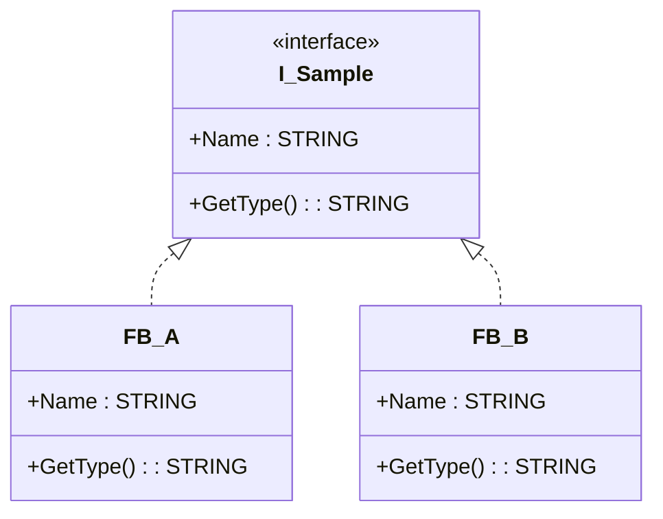
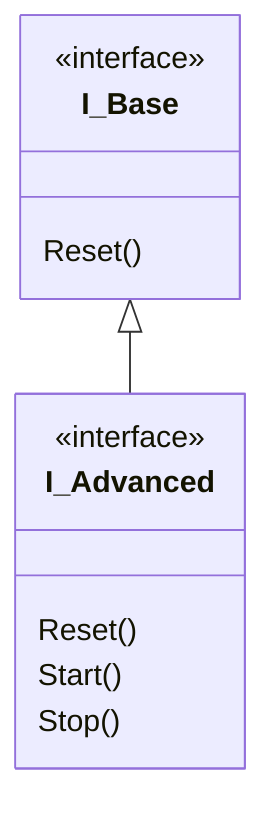

# 🧠 TwinCAT **OBJECT INTERFACE** — Seviye 3 Ultra Profesyonel Masterclass  
## + UML Diyagramları • Derleyici Uyarı Tabloları • Polymorphism • Interface Inheritance • ANY + GENERIC Kombinasyonları

---

# ## 1. GİRİŞ  
TwinCAT’te **INTERFACE**, tamamen soyut bir sözleşme tanımlayan, yalnızca *method* ve *property prototipleri* içeren, gerçek davranışı ise bu interface’i *IMPLEMENTS* eden Function Block’lara bırakan güçlü bir OOP mekanizmasıdır.

Bu Masterclass, klasik doküman bilgisini çok daha ileri seviyeye taşıyarak:

- Interface miras yapıları (EXTENDS)
- Polymorphic çalışma zamanlı davranışlar
- ANY / ANY_INT / GENERIC parametreli interface methodları
- Interface tabanlı bileşen mimarileri
- UML sınıf diyagramı benzeri modellemeler
- TwinCAT derleyici uyarıları ve tuzaklar

gibi üst seviye konuları kapsar.

---

# ## 2. UML BENZERİ INTERFACE MODELİ



Bu UML diyagramı, interface tabanlı yapının nasıl organize olduğunu görsel olarak açıklar.

---

# ## 3. INTERFACE SÖZDİZİSİ  

```iecst
INTERFACE I_Sample
    METHOD GetType : STRING
    PROPERTY Name : STRING
END_INTERFACE
```

Bir Function Block’ta implementasyonu:

```iecst
FUNCTION_BLOCK FB_A IMPLEMENTS I_Sample
```

---

# ## 4. INTERFACE DERLEYİCİ KURALLARI VE UYARI TABLOSU

| Durum | Derleyici Davranışı | Açıklama |
|------|----------------------|----------|
| Bir interface’deki method, FB’de yok | ❌ Hata | Prototip birebir eşleşmelidir. |
| Property Get/Set eksik | ❌ Hata | Her ikisi de gereklidir. |
| Tip uyuşmazlığı | ❌ Hata | Parametre ve dönüş tipleri %100 aynı olmalıdır. |
| Interface variable kullanılmadan çağrı | ❌ Runtime Null Risk | iSample=0 ise çağrı geçersizdir. |
| __ISVALIDREF ile kontrol | ❌ Desteklenmez | Interface referansları için geçerli değildir.  |

📌 **Önemli Not:**  
Interface değişkeninin geçerli bir FB instance içerdiğini kontrol etmek için:

```iecst
IF iSample <> 0 THEN
    ...
END_IF
```

---

# ## 5. INTERFACE INHERITANCE (KALITIM)

TwinCAT interface’ler birbiri üzerinden genişletilebilir:

```iecst
INTERFACE I_Base
    METHOD Reset : BOOL
END_INTERFACE

INTERFACE I_Advanced EXTENDS I_Base
    METHOD Start : BOOL
    METHOD Stop : BOOL
END_INTERFACE
```

UML:



---

# ## 6. POLYMORPHISM — ÇALIŞMA ZAMANI DAVRANIŞ SEÇİMİ

Polymorphism, interface değişkenine hangi FB instance atanmışsa o instance’ın methodlarının çağrılmasını sağlar.

```iecst
VAR
    device : I_Device;
    motor  : FB_Motor;
    valve  : FB_Valve;
END_VAR

device := motor;
device.Start();   // Motor’un Start methodunu çağırır

device := valve;
device.Start();   // Valve’ın Start methodunu çağırır
```

Bu mekanizma sayesinde farklı türde nesneler **tek tip altından kontrol edilir**.

---

# ## 7. INTERFACE + ANY + GENERIC KOMBİNASYONLARI

Interface methodları ANY veya GENERIC parametre içerebilir:

```iecst
INTERFACE I_Compute
    METHOD Compute : BOOL
    VAR_INPUT
        anyValue : ANY;
    END_VAR
END_INTERFACE
```

Bir FB implementasyonu:

```iecst
METHOD Compute : BOOL
VAR_INPUT
    anyValue : ANY;
END_VAR

CASE anyValue.typeclass OF
    __SYSTEM.TYPE_CLASS.TYPE_INT:
        ...
    __SYSTEM.TYPE_CLASS.TYPE_REAL:
        ...
END_CASE
```

Bu sayede interface, *dinamik tiplerle* çalışabilir → Bu, TwinCAT’te gerçek anlamda **polymorphic generic computation** sağlar.

---

# ## 8. GELİŞMİŞ UYGULAMA: STRATEJİ PATTERN

Interface kullanılarak Strategy Pattern TwinCAT'te uygulanabilir:

```iecst
INTERFACE I_Filter
    METHOD ApplyFilter : REAL
    VAR_INPUT
        value : REAL;
    END_VAR
END_INTERFACE

FUNCTION_BLOCK FB_LowPass IMPLEMENTS I_Filter
METHOD ApplyFilter : REAL
ApplyFilter := value * 0.5;

FUNCTION_BLOCK FB_HighPass IMPLEMENTS I_Filter
METHOD ApplyFilter : REAL
ApplyFilter := value * 2.0;
```

Kullanım:

```iecst
filter : I_Filter;
low    : FB_LowPass;
high   : FB_HighPass;

filter := low;
filtered := filter.ApplyFilter(100);

filter := high;
filtered := filter.ApplyFilter(100);
```

---

# ## 9. DERİN TEKNİK NOTLAR (LEVEL 3 INSIGHTS)

### ✔ Interface değişkenleri **her zaman referanstır**
Bellek kopyalanmaz; yalnızca gösterici atanır.

### ✔ Online Change sırasında interface ref yönlendirmesi gerçekleşir  
TwinCAT referansları yeni bellek bloklarına taşır → Büyük projelerde gecikme yaratabilir.

### ✔ Interface methodları overload edilemez  
İsim-tam eşleşme zorunludur.

### ✔ Interface'de implementasyon *asla* olamaz  
Sadece prototipler bulunur.

---

# ## 10. TAM UYGULAMA ÖRNEĞİ

```iecst
INTERFACE I_Device
    METHOD Start : BOOL
    METHOD Stop  : BOOL
END_INTERFACE

FUNCTION_BLOCK FB_Pump IMPLEMENTS I_Device
METHOD Start : BOOL
Start := TRUE;

METHOD Stop : BOOL
Stop := TRUE;

FUNCTION_BLOCK FB_Fan IMPLEMENTS I_Device
METHOD Start : BOOL
Start := TRUE;

METHOD Stop : BOOL
Stop := TRUE;

PROGRAM MAIN
VAR
    dev : I_Device;
    pump : FB_Pump;
    fan  : FB_Fan;
END_VAR

dev := pump;
dev.Start();

dev := fan;
dev.Start();
```

---

# ## 11. SONUÇ  
TwinCAT Interface sistemi, PLC programlamada **gerçek OOP mimarisi**, **polymorphism**, **bağımlılık azaltma**, **kod standardizasyonu** ve **test edilebilirlik** sağlar.

Bu Masterclass, interface yapısının sadece temel değil, mimari seviyedeki kullanımını öğretir.

---

