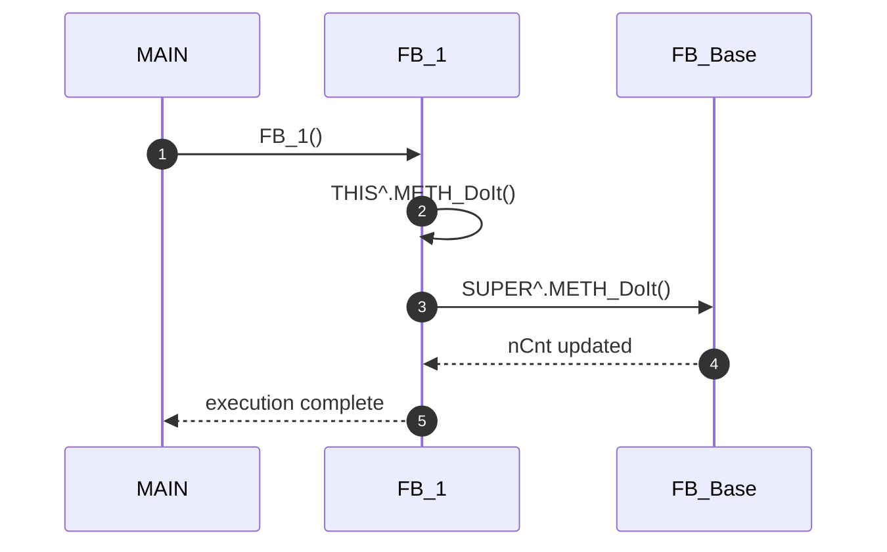
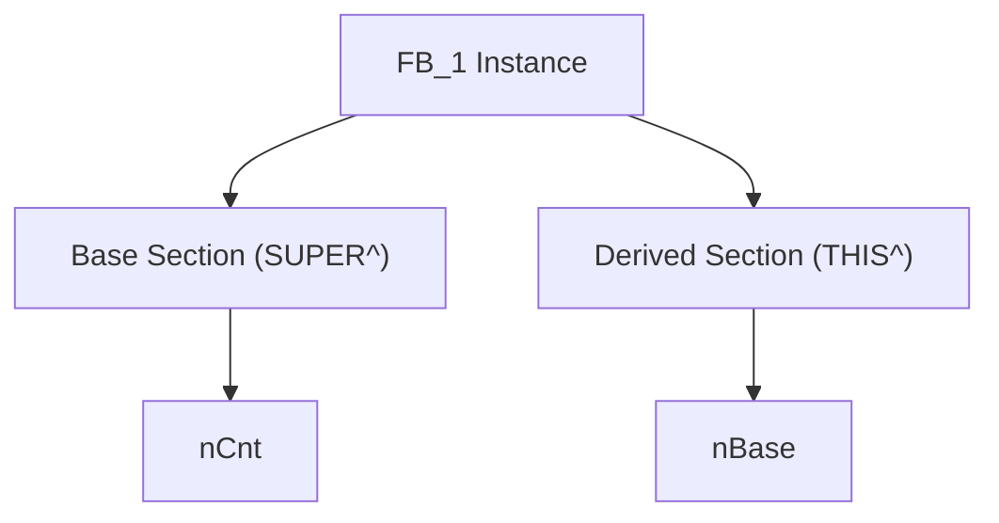
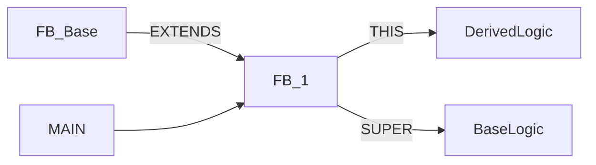

# **SUPER & THIS POINTER — IEC 61131-3 OOP TEKNİK EĞİTİMİ**  


# 1. Giriş — PLC'de OOP Gerçekte Nasıl Çalışır?

PLC OOP, klasik dillerdeki (C++, Java) OOP’nin _hafifleştirilmiş_ bir sürümüdür.  
Amaç: **deterministik zaman**, **cycle tabanlı execution**, **memory predictability**.

Bu nedenle PLC OOP:

- Gerçek anlamda “dynamic polymorphism” içermez  
- Her FB örneği **statik olarak assign edilmiş memory block** kullanır  
- Inheritance çalışma zamanı değil, **derleme zamanı mekanizmasıdır**

---

# 2. SUPER Pointer’ın Derin Mimari Mantığı

`SUPER` aslında:

- Derleyici tarafından oluşturulan özel bir **internal pointer**  
- Derived FB instance içindeki **base FB alanını işaret eder**  
- C++’taki `Base::method()` benzeri davranış sergiler

SUPER çalışma zamanında adres hesaplamaz — **statik offset** içerir.

```txt
[FB_1 Instance Memory]
┌───────────────────────────────┐
│ FB_Base Part (SUPER^)         │  <── SUPER^. -> Bu alan
├───────────────────────────────┤
│ FB_1 Part (THIS^)             │  <── THIS^.  -> Derived alan
└───────────────────────────────┘
```

---

# 3. THIS Pointer’ın Memory Modeli

`THIS` pointer:

- Her metod çağrısında implicit geçilir
- Asla dynamic reference üretmez
- FB instance’ın _tamamını_ adresler, sadece derived kısmını değil

THIS içinden SUPER alanına erişim yapılmaz; SUPER bunu sağlamak için offset içerir.

---

# 4. Codesys / TwinCAT Runtime Farkları

| Özellik | Codesys Runtime | TwinCAT Runtime |
|--------|----------------|------------------|
| Inheritance Derinliği | Derin destek | Tam destek |
| SUPER davranışı | Statik | Statik + optimize |
| VTable benzeri dispatch | Yok | Kısmi inline optimizasyon |
| Inline metod destek | Kısmi | Agresif |

TwinCAT, call dispatch sırasında **dead code elimination** yapabildiği için SUPER çağrıları daha hızlıdır.

---

# 5. Inheritance Derin Yapısı (VTable Benzeri Mantık)

PLC runtime’da gerçek vtable yoktur, fakat derleyici şu mantığı simüle eder:

```
Derived_FB {
    Base_FB Members
    Derived_FB Members
}
```

Override edilen metodlar için override tablosu oluşturulur:

```
METH_DoIt :
    FB_1 version -> FIRST
    FB_Base version -> SUPER
```

---

# 6. Polymorphic Dispatch & Call Resolution

Metod çözümleme sırası:

1️⃣ Metod önce derived FB’de aranır  
2️⃣ Bulunmazsa base FB’de aranır  
3️⃣ SUPER çağrısı doğrudan base FB metoduna gider  
4️⃣ THIS çağrısı override edilmiş versiyona gider  

---

# 7. SUPER ↔ THIS Çağrı Sırası (Call Stack Diyagramı)



---

# 8. FB Memory Layout — Derin Teknik Diyagram



---

# 9. Override Kuralları — Profesyonel Notlar

### ✔ Doğru override:
```st
METHOD METH_DoIt : BOOL
SUPER^.METH_DoIt();    // Base davranışı koru
nCnt := nCnt + 100;    // Yeni davranış ekle
```

### ❌ Yanlış override:
```st
SUPER^.METH_DoIt();
SUPER^.nCnt := 0;      // Base'in mantığını bozarsın
```

---

# 10. Yanlış Kullanımlar

### ❌ FB_1 içinde SUPER değişkenlerini yeniden yazmak  
### ❌ SUPER çağrısını gereksiz yere tekrarlamak  
### ❌ Derived FB’de base davranışını tamamen iptal etmek  

---

# 11. Doğru Endüstriyel Tasarım Pattern’ları

### 🟩 Template Base FB + Derived Implementation  
### 🟩 Abstract davranış (PLC'de interface ile)  
### 🟩 State pattern + inheritance  
### 🟩 Safety logic için override koruması  

---

# 12. Fabrika Pattern’i ve SUPER Kullanımı

Makine ailesi için ideal senaryo:

- Base FB → Ortak davranış
- Derived FB → Makine tipine özel davranış

SUPER burada ortak fonksiyon çağrılarının garantörüdür.

---

# 13. State Machine Pattern’i ile Inheritance

Her state kendi FB olabilir → SUPER metodu base state davranışını korur.

---

# 14. Test & Debug Teknikleri

### ✔ Derived metod çalışıyor mu?  
THIS^.METH_DoIt() → BREAKPOINT → Doğru yerde durmalı

### ✔ Base metod çalışıyor mu?  
SUPER^.METH_DoIt() → memory değişimini izle  
nCnt == -1 ise base metod çalışmıştır.

---

# 15. MAIN Programında Gerçek Zamanlı Davranış

- Her cycle FB tekrar çağrılır  
- Inheritance overhead **çok düşüktür**  
- SUPER çağrısı ek CPU maliyeti yaratmaz (statik adresleme)

---

# 16. Tüm Mimarinin Ana Diyagramı



---

# 17. Sonuç & Mimari Öneriler

- SUPER **base davranışı garanti altına alır**  
- THIS **mevcut FB'nin tüm kontrolünü sağlar**  
- Büyük sistemlerde inheritance *temiz mimari* sağlar  
- TwinCAT → agresif optimize  
- Codesys → daha stabil OOP modeli  

---


