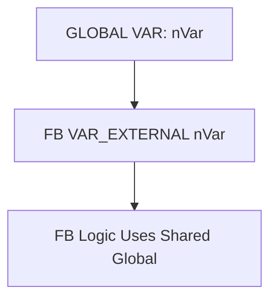

# 🧠 SEVİYE 3 ULTRA PROFESYONEL MASTERCLASS  
# **VAR_EXTERNAL — EXTERNAL VARIABLES DERİN TEKNİK EĞİTİMİ**

---

# 📌 İçindekiler
1. VAR_EXTERNAL Nedir?  
2. IEC 61131-3 Standardındaki Yeri  
3. TwinCAT Runtime Davranışı  
4. Derleyici Referans Çözümleme  
5. Global Memory Binding  
6. AT %I / %Q ile İlgili Kritik Uyarılar  
7. Process Image Duplication Riski  
8. VAR_GLOBAL ↔ VAR_EXTERNAL Mimari Farkı  
9. Initialization Neden Yasaktır?  
10. Multi-POU Erişim Çatışmaları  
11. Endüstriyel Kullanım Senaryoları  
12. Hatalı Kullanımlar  
13. Doğru Mimari Kullanım  
14. Memory & Namespace Diyagramı  
15. Performans ve Güvenlik  
16. Test & Debug Teknikleri  
17. Örnek Kod  
18. Sonuç

---

# 1. VAR_EXTERNAL Nedir?
`VAR_EXTERNAL`, başka bir POU’da tanımlı **global değişkeni** içeriye "ithal etmek" için kullanılan bir mekanizmadır.

- Global değişkenin **kopyası oluşturulmaz**  
- Değişken **FB içinde yerel isimle kullanılabilir**  
- TwinCAT 3’te zorunlu değildir ama **IEC uyumluluğu için** desteklenir  

Örnek:
```st
VAR_EXTERNAL
    nVarExt1 : INT;
END_VAR
```

---

# 2. IEC 61131-3 Standardındaki Yeri
IEC’e göre:
- Bir POU içinde kullanılan global değişkenler **VAR_EXTERNAL** ile bildirilmelidir.
- TwinCAT, modern yaklaşım olarak bunu opsiyonel yapmıştır.

---

# 3. TwinCAT Runtime Davranışı
TwinCAT’te:
- Global değişken **her yerden doğrudan adıyla** kullanılabilir.  
- `VAR_EXTERNAL` yalnızca **beyan seviyesinde** bir gerekliliktir.  
- Runtime’da ekstra bellek tüketimi yapmaz.

---

# 4. Derleyici Referans Çözümleme
Derleyici şu adımları izler:

1. External değişken adı global listede aranır  
2. Tür uyum kontrolü yapılır  
3. Eğer global değişken yoksa hata verilir  
4. Lokal bir gölge değişken (shadow copy) oluşturulmaz  

---

# 5. Global Memory Binding
VAR_EXTERNAL, global değişkenin **aynı belleğini** kullanır.



---

# 6. AT %I / %Q ile İlgili Kritik Uyarılar
EXTREMELY IMPORTANT:

> IO adreslemeleri (**AT %I**, **AT %Q**) yalnızca GLOBAL seviyede yapılmalıdır.

FB içinde AT ile external tanımlamak **KESİN YASAKTIR**:

```st
VAR_EXTERNAL
    sensor AT %I0.0 : BOOL;  // TEHLİKELİ
END_VAR
```

---

# 7. Process Image Duplication Riski
Aynı adres iki kez map edilirse:

- Process image bozularak iki farklı mapping oluşur  
- PLC cycle nondeterministic hale gelir  
- IO verisi tutarsız olur  
- Donanım resource conflict tetiklenir  

Bu nedenle:

### ✔ IO adresleri sadece GLOBAL bölümde tanımlanır  
### ✔ External deklarasyon **adres içermez**

---

# 8. VAR_GLOBAL ↔ VAR_EXTERNAL Mimari Farkı

| Özellik | VAR_GLOBAL | VAR_EXTERNAL |
|--------|-------------|--------------|
| Tanım yeri | Global list | POU içi |
| Kopya | Tek | Kopya yok |
| Erişim | Her yerden | Sadece POU içinden |
| Initialization | Var | Yasak |

---

# 9. Initialization Neden Yasaktır?

Aşağıdaki kullanım yasaktır:

```st
VAR_EXTERNAL
    xFlag : BOOL := TRUE;  // HATA
END_VAR
```

Sebebi:
- Global değişken zaten kendi initialization’ına sahiptir  
- External değişkende tekrar initialization **tutarsızlık** yaratır  

---

# 10. Multi-POU Erişim Çatışmaları
Her POU global değişkene yazabilir → bu:

- Synchronization hatalarına  
- Yazma yarışlarına  
- Zamanlama bozulmalarına  
- State machine kararsızlıklarına  

neden olur.

Prof. mimari gereği:

✔ Yazıcı (writer) POU sayısı en aza indirilmeli  
✔ Okuyucu (reader) POU sayısı sınırsız olabilir  

---

# 11. Endüstriyel Kullanım Senaryoları

### ✔ State / Mode paylaşımı  
### ✔ Diagnostic / Status değişkenleri  
### ✔ SCADA tag erişimi  
### ✔ HMI kontrol sinyalleri  
### ✔ System-level counters  

---

# 12. Hatalı Kullanımlar

### ❌ Hata 1 — AT adresli external
```st
sensor AT %I0.1 : BOOL;  // Yanlış
```

### ❌ Hata 2 — Global olmayan değişkeni external yapmak
```st
VAR_EXTERNAL
    localVar : INT;  // derlenmez
```

### ❌ Hata 3 — Initialization
```st
xExt := TRUE; // External’da yasak
```

---

# 13. Doğru Mimari Kullanım

### ✔ Global değişken sadece GLOBAL listede tanımlanır  
### ✔ POU içinde VAR_EXTERNAL veya direkt isimle kullanılır  
### ✔ IO adresleme sadece GLOBAL seviyede yapılır  
### ✔ Çok instance’lı FB’lerde external kullanım azaltılır  

---

# 14. Memory & Namespace Diyagramı


---

# 15. Performans ve Güvenlik

- Performans maliyeti yoktur  
- Global değişkenler thread-safe değildir  
- Safety PLC’de çok dikkatli kullanılmalıdır  

---

# 16. Test & Debug Teknikleri

✔ Watch tablosunda global değişken izlenir  
✔ PLC Task priority → write conflicts analiz edilir  
✔ Simulation modunda değişken değişimi izlenir  

---

# 17. Örnek Kod

```st
// GLOBAL
VAR_GLOBAL
    nCounter : INT;
END_VAR

// FB
FUNCTION_BLOCK FB_Sample
VAR_EXTERNAL
    nCounter : INT;
END_VAR

nCounter := nCounter + 1;
```

---

# 18. Sonuç

VAR_EXTERNAL:

- IEC uyumluluğu için gereken bir yapıdır  
- TwinCAT 3’te runtime etkisi yoktur  
- Global değişkeni FB içine “ithal eder”  
- Yanlış kullanım IO image bozulmasına sebep olabilir  

Profesyonel tasarımda dikkatli kullanılmalıdır.

