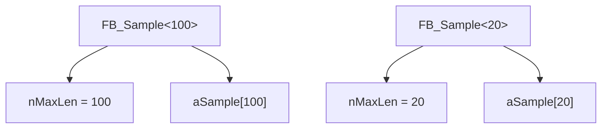
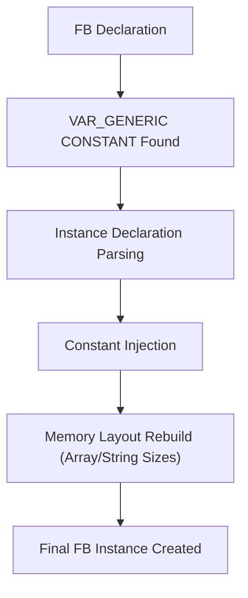

# 🧠 SEVİYE 3 ULTRA PROFESYONEL MASTERCLASS  
# **VAR_GENERIC CONSTANT — GENERIC CONSTANT VARIABLES DERİN TEKNİK EĞİTİMİ**

---

# 📌 İçindekiler
1. VAR_GENERIC CONSTANT Nedir?  
2. TwinCAT Compiler Architecture – Constant Injection  
3. Compile-Time vs Instance-Time Binding  
4. Neden Sadece Integer Türleri?  
5. Initial Value Overwrite Mekanizması  
6. Online Change Neden Desteklenmez?  
7. Array / String / Buffer Yapılarında Kullanım  
8. Expression-Based Generic Değerler  
9. Memory Model – Instance-Based Constant Partitioning  
10. EXTENDS & IMPLEMENTS ile Kullanım  
11. Generic Declaration Ordering Rules  
12. Hatalı Kullanım Senaryoları  
13. Endüstriyel Kullanım Örnekleri  
14. Derleyici Diyagramı  
15. Örnek Kodlar  
16. Sonuç

---

# 1. VAR_GENERIC CONSTANT Nedir?

`VAR_GENERIC CONSTANT`, TwinCAT 3.1 build 4026 itibarıyla kullanılabilen, **FB instance'ına özel sabit değer atanmasını** sağlayan bir deklarasyon bölümüdür.

Özellikleri:
- Her FB instance için farklı bir constant atanabilir  
- Runtime boyunca değiştirilemez  
- Compile-time’da array, buffer, string uzunluğu gibi tip şekillendirme amacıyla kullanılır  
- Initial value sadece **derleyici kontrolü** içindir; runtime’da overwrite edilir  

Örnek:
```st
FUNCTION_BLOCK FB_Sample
VAR_GENERIC CONSTANT
    nMaxLen : UDINT := 1;  // compile check only
END_VAR
```

---

# 2. TwinCAT Compiler Architecture – Constant Injection

Compiler aşağıdaki sırayla çalışır:

1. FB’de generic constant deklarasyonunu okur  
2. Instance declaration’da `<value>` parametresini bulur  
3. Constant tablosunu yeniden oluşturur  
4. Array/string/buffer layout’unu bu değere göre derler  
5. Her instance için **farklı tip** oluşabilir  

Bu, C++ template benzeri davranış sağlar.

---

# 3. Compile-Time vs Instance-Time Binding

```st
fbSample1 : FB_Sample<100>;
fbSample2 : FB_Sample<(2*cConst)>;
```

- `<100>` → literal → compile-time  
- `<(2*cConst)>` → expression → compile-time evaluation  
- Son değer instance’a constant olarak uygulanır  

| Instance | nMaxLen | aSample Boyutu |
|----------|---------|----------------|
| fbSample1 | 100 | ARRAY[0..99] |
| fbSample2 | 200 | ARRAY[0..199] |

Her iki instance teknik olarak **farklı bir FB tipi** temsil eder.

---

# 4. Neden Sadece Integer Türleri?

Çünkü:
- Array sınırları  
- String uzunlukları  
- Memory offset hesaplamaları  

tamamen integer tabanlıdır.

TwinCAT compiler bu yüzden generic constant için sadece SAYISAL türlere izin verir.

---

# 5. Initial Value Overwrite Mekanizması

Initial value:

```st
nMaxLen : UDINT := 1;
```

yalnızca derleyicinin tip kontrolü yapabilmesi içindir.

Runtime’da:

```
nMaxLen := <instance-specific-value>;
```

ile **otomatik olarak üzerine yazılır**  
Kullanıcı bunu değiştiremez.

---

# 6. Online Change Neden Desteklenmez?

VAR_GENERIC CONSTANT, FB’nin memory layout’unu değiştirir:

- Array büyüklüğü  
- Field offset’leri  
- Instance RAM haritası  

Bu değişiklik **runtime patch edilemez** → Bu nedenle:

> VAR_GENERIC CONSTANT içeren FB’lerde ONLINE CHANGE yasaktır.  
> FULL DOWNLOAD zorunludur.

---

# 7. Array / String / Buffer Kullanımı

```st
aSample : ARRAY[0..nMaxLen-1] OF BYTE;
```

Generic constant ile:

- Array uzunluğu instance’a göre değişir  
- Kod tekrarı ortadan kalkar  
- Büyük kütüphaneler için son derece esnektir  

Aynı yaklaşım string ve byte buffer tanımlarında da geçerlidir.

---

# 8. Expression-Based Generic Value Assignment

İzin verilir:

```st
fbSample2 : FB_Sample<(2*cConst)>;
```

Kural:
- Expression mutlaka **round brackets ()** içinde olmalıdır.  
- Aksi halde `<` ve `>` parser conflict yaratır.

Bu ifadeler **compile-time’da** hesaplanır → runtime maliyeti sıfırdır.

---

# 9. Memory Model – Instance-Based Constant Partitioning



Her instance kendi constant değerine bağlı olarak **farklı memory layout** üretir.

---

# 10. EXTENDS & IMPLEMENTS ile Kullanım

Generic constant kullanan bir FB inheritance ile uyumludur.

Örnek:

```st
FUNCTION_BLOCK FB_Sub_1 EXTENDS FB_Sample<100>
```

Ya da:

```st
FUNCTION_BLOCK FB_Sub_2
VAR_GENERIC CONSTANT
    nMaxLen2 : UDINT := 1;
END_VAR
EXTENDS FB_Sample<nMaxLen2>
```

### Derleyici Kuralı:
Generic CONSTANT bölümü, **EXTENDS/IMPLEMENTS’ten önce gelmelidir**  
→ Çünkü base class generic constant’a bağlı olabilir.

---

# 11. Generic Declaration Ordering Rules

Doğru sıralama:

```st
FUNCTION_BLOCK FB_Sub
VAR_GENERIC CONSTANT
    nMaxLen : UDINT := 1;
END_VAR
EXTENDS FB_Base<nMaxLen>
```

Yanlış (derleyici hatası):

```st
FUNCTION_BLOCK FB_Sub
EXTENDS FB_Base<nMaxLen>
VAR_GENERIC CONSTANT
    nMaxLen : UDINT := 1;
END_VAR
```

---

# 12. Hatalı Kullanım Senaryoları

### ❌ Runtime’da değeri değiştirmeye çalışmak
```st
nMaxLen := 50; // İmkansız, CONSTANT
```

### ❌ Online change yapmak
Online change → Red LED → "Full Download Required"

### ❌ Generic constant’ı boolean/real/struct yapmaya çalışmak
Sadece integer allowed.

---

# 13. Endüstriyel Kullanım Örnekleri

✔ Generic FIFO/LIFO buffer tasarımları  
✔ Frame parser (Modbus, CANopen, Profinet)  
✔ Değişken boyutlu lookup table FB’leri  
✔ Library FB’lerinin esnekleştirilmesi  
✔ Çok instance’lı IO handler FB’lerinde data block ölçeklendirme  

---

# 14. Derleyici Diyagramı



---

# 15. Örnek Kod

## FB Tanımı
```st
FUNCTION_BLOCK FB_Sample
VAR_GENERIC CONSTANT
    nMaxLen : UDINT := 1;
END_VAR
VAR
    aSample : ARRAY[0..nMaxLen-1] OF BYTE;
END_VAR
```

## Instance’lar
```st
PROGRAM MAIN
VAR CONSTANT
    cConst : DINT := 10;
END_VAR

VAR
    fbSample1 : FB_Sample<100>;
    fbSample2 : FB_Sample<(2*cConst)>;  // 20
    aSample   : ARRAY[0..5] OF FB_Sample<10>;
END_VAR
```

---

# 16. Sonuç

VAR_GENERIC CONSTANT:

- Instance özelinde constant injection sağlar  
- FB memory layout'unu şekillendirir  
- Online change desteklemez  
- Büyük ölçekli kütüphane geliştirme için en kritik özelliklerden biridir  
- C++ template davranışına en yakın IEC dışı TwinCAT özelliğidir  

Bu mekanizma, TwinCAT’i endüstride diğer IEC platformlarından ayrıştıran gelişmiş bir OOP yeteneğidir.

