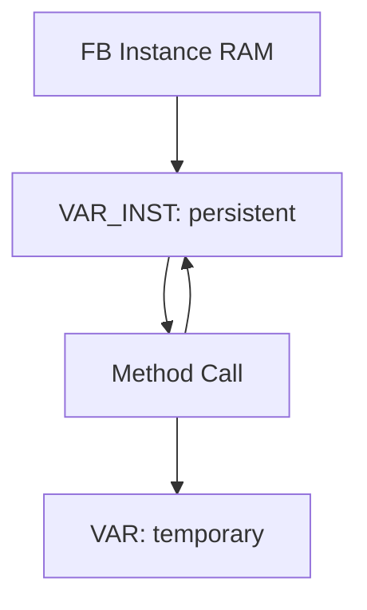

# 🧠 SEVİYE 3 ULTRA PROFESYONEL MASTERCLASS  
# **VAR_INST — INSTANCE VARIABLES DERİN TEKNİK EĞİTİMİ**

---

# 📌 İçindekiler
1. VAR_INST Nedir?  
2. TwinCAT Memory Modeli  
3. VAR_INST Neden Method Stack’te Saklanmaz?  
4. Yaşam Döngüsü (Lifecycle)  
5. VAR vs VAR_INPUT vs VAR_INST — Derin Karşılaştırma  
6. OOP Tasarımındaki Rolü  
7. Initialization Kuralları  
8. Hatalı Kullanımlar  
9. Endüstriyel Kullanım Senaryoları  
10. VAR_INST ile State Tracking  
11. Bellek Organizasyonu Diyagramı  
12. Örnek Kod  
13. Performans & Threading Etkileri  
14. Profesyonel Tasarım Önerileri  
15. Sonuç

---

# 1. VAR_INST Nedir?
`VAR_INST`, yalnızca **function block metodunda** kullanılabilen özel bir değişken alanıdır.

Özellikleri:
- Değişken method stack’te tutulmaz  
- **FB instance RAM** içinde depolanır  
- Method çağrıları arasında **değerini korur**  
- Sadece ilgili metod içinde erişilebilir  
- Instance başına bir adet bulunur  

Bu, method özelinde “private persistent storage” sağlar.

---

# 2. TwinCAT Memory Modeli
TwinCAT’te bir method çağrısında:

| Değişken türü | Saklandığı yer |
|----------------|----------------|
| `VAR` | Method stack (her çağrıda yeniden oluşur) |
| `VAR_INPUT` | Call frame stack |
| **`VAR_INST`** | **FB instance memory** (persist) |

---

# 3. VAR_INST Neden Method Stack’te Saklanmaz?

Çünkü amaç:
- Son değerleri saklamak  
- Geçmiş durumu hatırlamak  
- Cycle-to-cycle state tracking yapmak  

Bu nedenle method stack yerine instance memory kullanılır.

TwinCAT derleyicisi:

```
VAR_INST → instance RAM offset
```

ile derleme zamanı bağlar.

---

# 4. Yaşam Döngüsü (Lifecycle)

| Olay | VAR_INST davranışı |
|------|---------------------|
| FB oluşturma | Initialize edilir |
| Method çağrısı | Eski değer korunur |
| Bir sonraki çağrı | Önceki değerle devam eder |
| PLC Stop → Run | Genellikle resetlenir |
| Cold Start | Resetlenir |
| Download | Resetlenir |

---

# 5. VAR vs VAR_INPUT vs VAR_INST

| Tür | Scope | Yaşam | Reset davranışı |
|------|--------|---------|-----------------------|
| `VAR` | Method | Çağrı süresi | ✔ Her çağrıda reset |
| `VAR_INPUT` | Method | Çağrı süresi | ✔ Reset |
| **`VAR_INST`** | **Instance** | **FB ömrü boyunca** | ❌ Reset olmaz (çağrılar arası) |

---

# 6. OOP Tasarımındaki Rolü

VAR_INST = “method'a özel, instance-level field”

Bu, OOP’deki şu kavramla örtüşür:

> **Private member variable but scoped to one method**

Kullanım amacı:
- Method state’i saklamak  
- Edge detection  
- Geçmiş giriş değerini tutmak  
- Debounce / filtering yapmak  

---

# 7. Initialization Kuralları

VAR_INST **sadece literal** veya **FB içinde erişilebilen global/instans** değerlerle initialize edilebilir.

Aşağıdakiler **YANLIŞTIR**:

```st
VAR_INST
    x := MethodInput;   // HATA
```

```st
VAR_INST
    x := OtherInstanceVariable;  // HATA
```

Doğru:

```st
VAR_INST
    counter : INT := 0;
END_VAR
```

---

# 8. Hatalı Kullanımlar

### ❌ Method input ile initialization:
```st
VAR_INST
    last := nInput;   // HATA
```

### ❌ Attribute eklemek:
```st
{{attribute 'qualified_only'}} // HATA
```

### ❌ VAR_INST’i lokal değişken gibi kullanmaya çalışmak

### ❌ VAR_INST’i paralel tasklarda aynı metoda erişirken kullanmak  
→ Race condition oluşur.

---

# 9. Endüstriyel Kullanım Senaryoları

✔ Edge detection  
✔ Debounce  
✔ Son değer saklama  
✔ Method içi küçük state machine  
✔ Giriş-çıkış filtreleme  
✔ Motion ve IO methodlarında last-cycle tracking  

---

# 10. VAR_INST ile State Tracking

```st
METHOD DetectRise : BOOL
VAR_INPUT
    xIn : BOOL;
END_VAR
VAR_INST
    xLast : BOOL := FALSE;
END_VAR

DetectRise := (xIn AND NOT xLast);
xLast := xIn;
```

---

# 11. Bellek Organizasyonu Diyagramı



---

# 12. Örnek Kod

```st
METHOD MethLast : INT
VAR_INPUT
    nVar  : INT;
END_VAR
VAR_INST
    nLast : INT := 0;
END_VAR

MethLast := nLast;  // önceki değer döner
nLast    := nVar;   // yeni değer saklanır
```

---

# 13. Performans & Threading Etkileri

- VAR_INST erişimi çok hızlıdır (direct instance memory offset)  
- Stack allocation yapılmaz → performans avantajı  
- Multi-task kullanımı tehlikelidir  
- Thread-safe değildir  

---

# 14. Profesyonel Tasarım Önerileri

✔ VAR_INST → method state management için ideal  
✔ Initialization’da input VEYA diğer instance variable kullanma  
✔ Parallel task access varsa VAR_INST’TEN KAÇIN  
✔ Method davranışını deterministik tutmak için VAR_INST izole edilmelidir  

---

# 15. Sonuç

VAR_INST:
- Method içi persistent state yönetimi sağlar  
- OOP’deki private instance field’in TwinCAT karşılığıdır  
- Deterministik kontrol algoritmalarında kritik öneme sahiptir  
- Yanlış kullanım debug karmaşasına yol açabilir  

---

