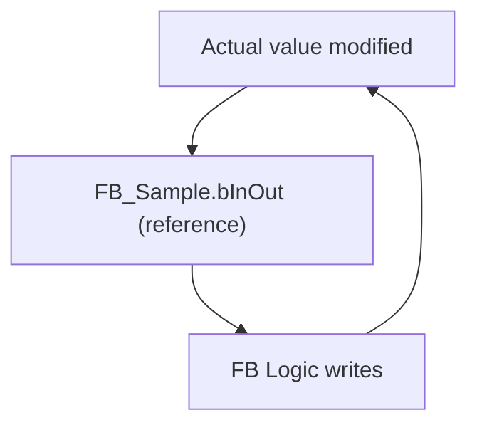
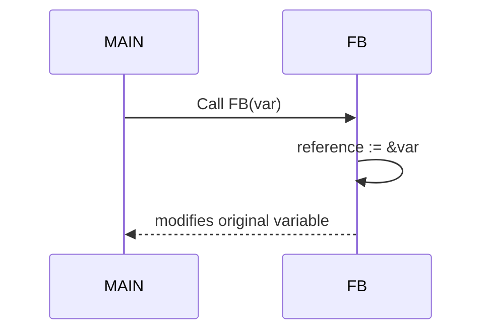
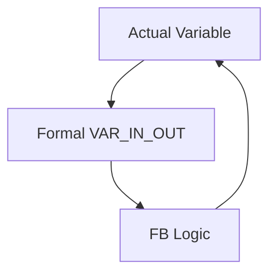

# 🧠 SEVİYE 3 ULTRA PROFESYONEL MASTERCLASS  
# **VAR_IN_OUT & VAR_IN_OUT CONSTANT — DERİN TEKNİK EĞİTİM (.md)**

## 📌 İçindekiler
1. Giriş — VAR_IN_OUT Gerçek Yapısı  
2. Derleyici Perspektifi  
3. Memory Model  
4. VAR_IN_OUT CONSTANT  
5. Codesys & TwinCAT Karşılaştırması  
6. STRING/WSTRING Aktarım Riskleri  
7. Bit Addressing & VAR_IN_OUT  
8. REFERENCE TO Karşılaştırması  
9. Aliasing Sorunu  
10. Yanlış Kullanımlar  
11. Doğru Pattern’lar  
12. Sequence Diagram  
13. Memory Layout  
14. CONSTANT Kuralları  
15. Büyük Proje Tasarımı  
16. Test & Debug  
17. Sonuç

---

# 1. Giriş — VAR_IN_OUT Gerçek Yapısı
`VAR_IN_OUT` PLC'de **call-by-reference** mekanizmasıdır. Kopya oluşturulmaz; formal parametre doğrudan gerçek değişkenin adresine bağlanır.

---

# 2. Derleyici Perspektifi
Çağrı:
```st
fbSample(bInOut := bTest);
```
Derleyicide:
```
FB_Sample.bInOut := &bTest;
```

---

# 3. Memory Model


---

# 4. VAR_IN_OUT CONSTANT
- Call-by-reference  
- **Readonly**  
- STRING aktarımlarında güvenlidir  

---

# 5. Codesys & TwinCAT
| Özellik | Codesys | TwinCAT |
|--------|---------|----------|
| Optimize | Orta | Yüksek |
| CONST kontrolü | Derleyici | JIT + Derleyici |

---

# 6. STRING/WSTRING Aktarım Riskleri
Kısa string → uzun VAR_IN_OUT parametresine geçilemez.

---

# 7. Bit Addressing & VAR_IN_OUT
Aşağıdaki yasaktır:
```
fb(bInOut := %MX0.1);
```

---

# 8. REFERENCE TO Karşılaştırması
VAR_IN_OUT avantajları:
- Her zaman geçerlidir  
- Stack değişken atanabilir  
- Readonly seçenek vardır  

---

# 9. Aliasing Sorunu
Aynı bellek → birden fazla isim.  
Kontrol edilmezse kararsız davranış tetikler.

---

# 10. Yanlış Kullanımlar
```st
fb.bInOut := TRUE; // HATA
fb(bInOut := TRUE); // HATA
fb(bInOut := sVar10TooShort); // HATA
```

---

# 11. Doğru Pattern’lar
```st
fb(bInOut := bTest); // Doğru
fb(bInOut := bTemp); // Bit workaround
```

---

# 12. Sequence Diagram


---

# 13. Memory Layout


---

# 14. CONSTANT Kuralları
- STRING literal → kabul  
- Temel tip literal → Replace constants OFF olmalı  

---

# 15. Büyük Proje Tasarımı
- VAR_IN_OUT kontrollü kullanılmalı  
- Safety bloklarında CONSTANT tercih edilmeli  

---

# 16. Test & Debug
- Breakpoint hem caller hem callee’de konur  
- Reference integrity izlenir  

---

# 17. Sonuç
Bu masterclass ile VAR_IN_OUT mekanizmasını endüstriyel seviyede öğrendiniz.
