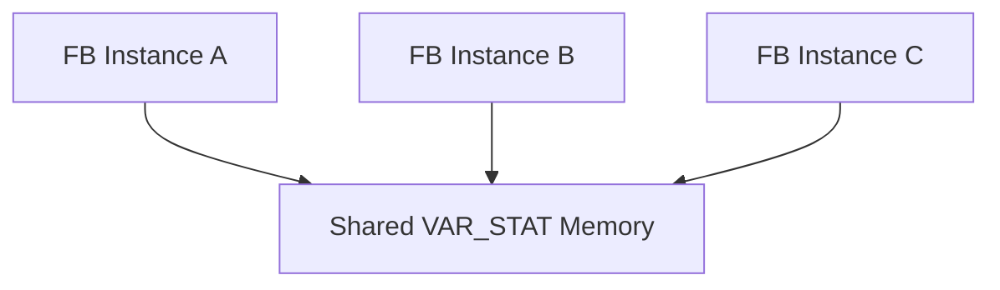
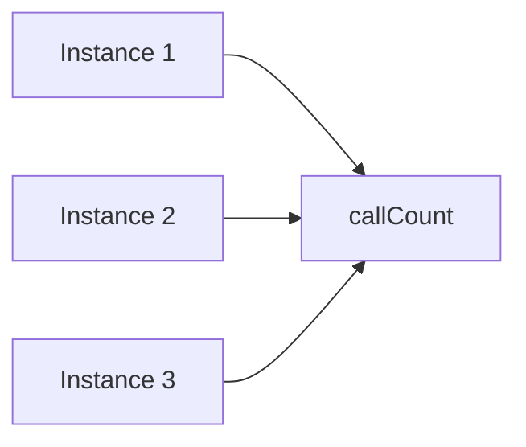

# 🧠 SEVİYE 3 ULTRA PROFESYONEL MASTERCLASS  
# **VAR_STAT — STATIC VARIABLES DERİN TEKNİK EĞİTİMİ**

---

# 📌 İçindekiler
1. VAR_STAT Nedir?  
2. Derleyici Davranışı  
3. Memory Model  
4. Yaşam Döngüsü  
5. Çoklu Instance Davranışı  
6. C Static ile Karşılaştırma  
7. VAR / VAR_STAT / VAR_INST / VAR_GLOBAL  
8. Hatalı Kullanımlar  
9. Endüstriyel Kullanım Senaryoları  
10. Attribute Kullanımı  
11. Örnek Kod  
12. Diyagram  
13. Performans & Thread Safety  
14. Profesyonel Tasarım Önerileri  
15. Test & Debug  
16. Sonuç

---

# 1. VAR_STAT Nedir?
TwinCAT'e özgü özel bir STATIC VARIABLE alanıdır.

- Yerel görünür  
- Global yaşayan  
- **Tek kopyalı**  
- Çoklu instance tarafından paylaşılan  

---

# 2. Derleyici Davranışı
```st
VAR_STAT
    counter : DINT;
END_VAR
```
Derleyici **sadece bir adet** `counter` alanı oluşturur.

---

# 3. Memory Model


---

# 4. Yaşam Döngüsü
| Durum | Davranış |
|-------|----------|
| Download | Initialize |
| Run | Değer korunur |
| Stop→Run | Genelde korunur |
| Instance oluşumu | Etkilemez |

---

# 5. Çoklu Instans Davranışı
Tüm instanslar **aynı statik değeri paylaşır**.

---

# 6. C Static ile Karşılaştırma
| Özellik | C static | VAR_STAT |
|--------|----------|-----------|
| Tek kopya | ✔ | ✔ |
| Yerel görünürlük | ✔ | ✔ |
| Çoklu çağrı koruma | ✔ | ✔ |
| Çoklu instance paylaşımı | Fonksiyon scope | FB scope |

---

# 7. Tür Karşılaştırması
| Tür | Yaşam | Görünürlük | Kopya |
|------|---------|--------------|--------|
| VAR | Instance | Üst seviye | Çok |
| VAR_INST | Instance | FB içi | Çok |
| VAR_GLOBAL | Global | Global | Tek |
| VAR_STAT | Static | FB içi | Tek |

---

# 8. Hatalı Kullanımlar
- Instance’a özel veri saklamak  
- Motion parametrelerini statik yapmak  
- Çoklu çekirdekte kilit kullanmadan VAR_STAT okuma–yazma  

---

# 9. Endüstriyel Kullanım Senaryoları
✔ Sistem sayaçları  
✔ Hata kodu depolama  
✔ Global state paylaşımı  
✔ Log counter  

---

# 10. Attribute Kullanımı
```st
VAR_STAT
{{attribute 'qualified_only'}}
mode : UINT;
END_VAR
```

---

# 11. Örnek Kod
```st
FUNCTION_BLOCK FB_Test
VAR_STAT
    callCount : UDINT;
END_VAR

callCount := callCount + 1;
```

---

# 12. Diyagram


---

# 13. Performans & Thread Safety
- STATIC RAM hızlıdır  
- Thread-safe değildir  
- Çoklu task erişiminde race condition oluşabilir  

---

# 14. Profesyonel Tasarım Önerileri
✔ VAR_STAT sadece paylaşılabilir global FB behavior için  
✔ Instance-bağımlı davranışlarda **kullanılmamalı**  
✔ Safety-critical yapılarda dikkatle yönetilmeli  

---

# 15. Test & Debug
- Watch tablosunda gözlemlenebilir  
- Cold Start reset için kullanılabilir  

---

# 16. Sonuç
VAR_STAT, TwinCAT'in IEC dışı güçlü bir STATIC mekanizmasıdır.  
Yanlış kullanılırsa ciddi mimari sorunlar yaratır, doğru kullanıldığında mükemmel bir sistem-state yöneticisidir.
